<p align="center">
  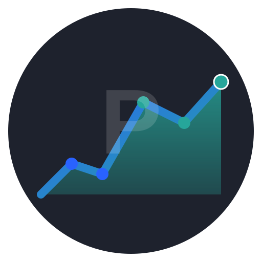
</p>

<h1 align="center">Portfolio Tracker Pro</h1>

<p align="center">
  <strong>Self-hosted portfolio tracker with AI assistant, real-time prices, and TradingView-style charts.</strong><br>
  Privacy-first. Mobile-ready. One Docker command to start.
</p>

<p align="center">
  
  
  
  
</p>

<p align="center">
  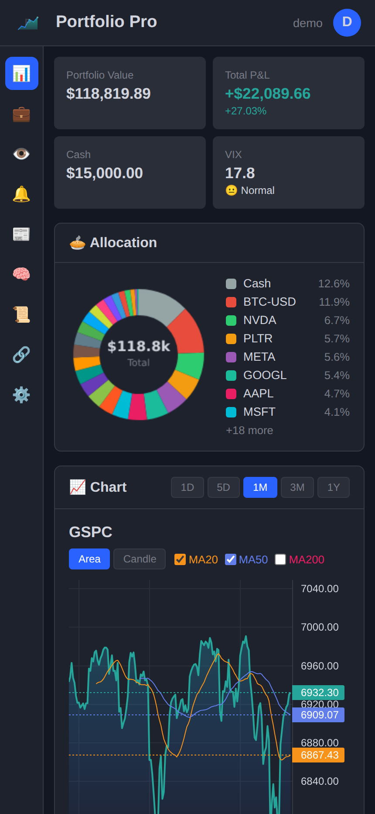
  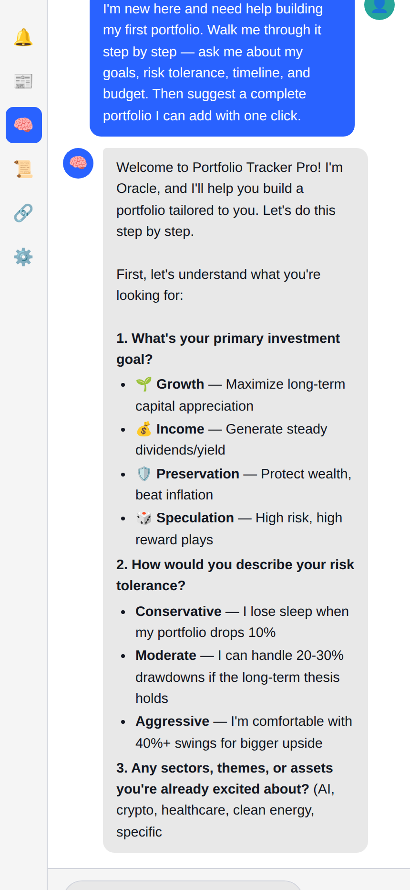
</p>

## Quick Start

```bash
docker run -d -p 8080:8080 -e JWT_SECRET=$(openssl rand -hex 32) -v portfolio-data:/app/data kiliansitel/portfolio-tracker-pro:latest
```

Open **http://localhost:8080** → create an account → start tracking.

> 🔑 **Set `JWT_SECRET`** for persistent sessions across container restarts.

> **Demo account included** — Username: `demo` / Password: `DemoPass123!`

## Features

- 🧠 **Oracle AI Assistant** — Chat with your portfolio. Build a portfolio from scratch with guided onboarding. Multi-provider (OpenAI, Anthropic, Google, Ollama, OpenRouter, OpenClaw). Streaming responses, context injection, conversation history
- 📊 **Interactive Charts** — TradingView-powered area/candlestick charts with MA overlays, allocation donut, performance tracking
- 💼 **Full Portfolio Tracking** — Stocks, options, crypto, cash. P&L, cost basis, transaction history, source/location tracking
- 🔗 **13-Chain Wallet Sync** — BTC, ETH, SOL, BNB + 9 more. Auto-detect ERC-20, SPL tokens, and DeFi positions
- 👀 **Smart Watchlists** — Multiple lists, category grouping, price targets, Telegram & push alerts
- 📱 **Mobile-First PWA** — Installable on any device. Responsive design, swipe actions, compact numbers
- 🔒 **Secure Multi-User** — JWT + Argon2id auth, CSP, rate limiting, session management
- 💾 **Backup & Import** — Full DB backup/restore, broker CSV import (Keytrade, IBKR, DeGiro)
- 🐳 **Docker Ready** — Multi-arch images (amd64/arm64), CI/CD pipeline, one-line deploy

<p align="center">
  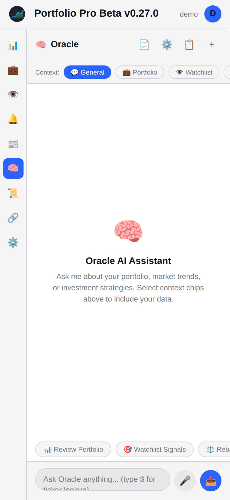
  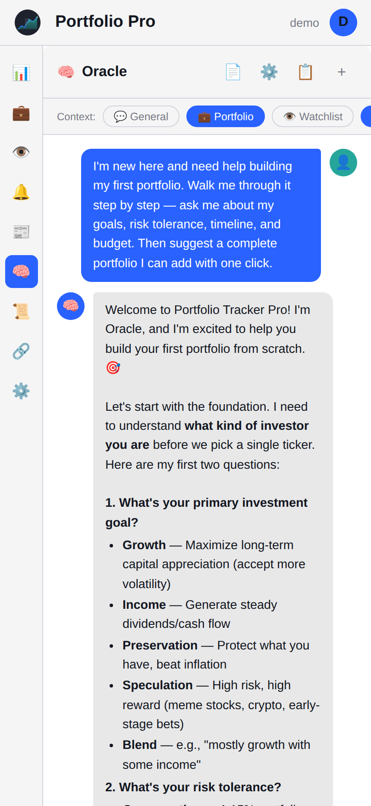
</p>

<p align="center">
  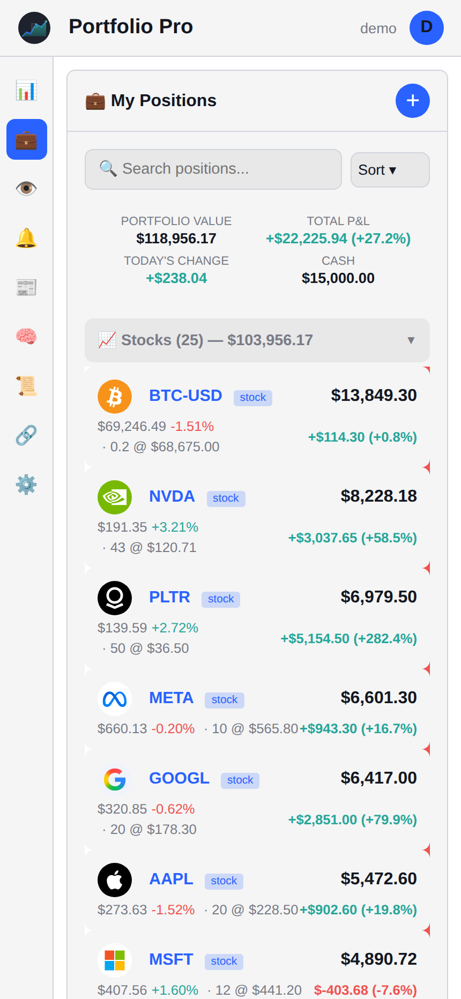
  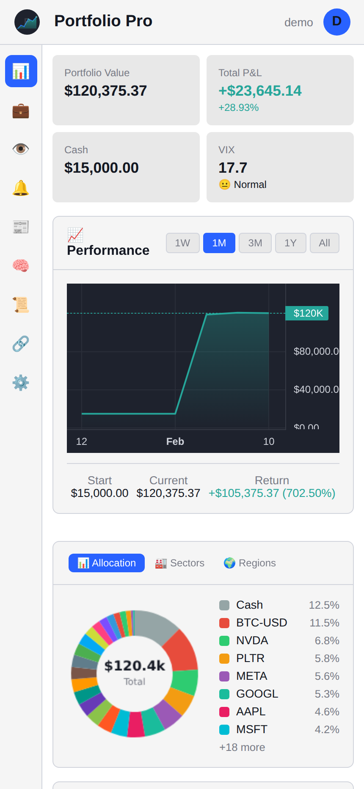
</p>

<details>
<summary>📸 More Screenshots</summary>

<p align="center">
  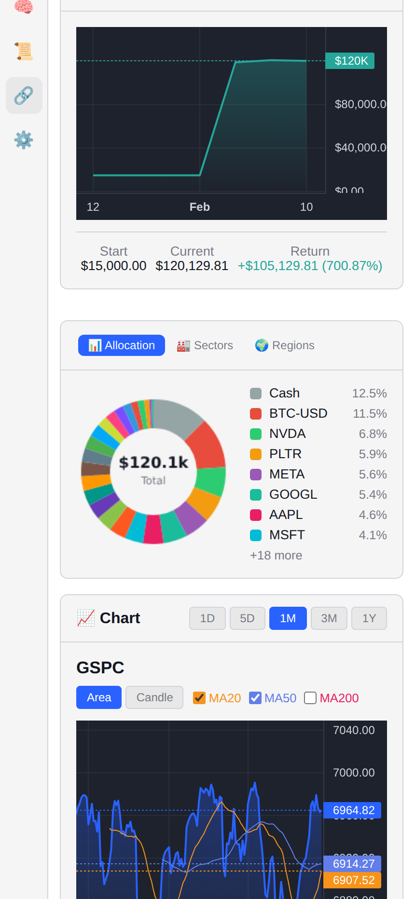
  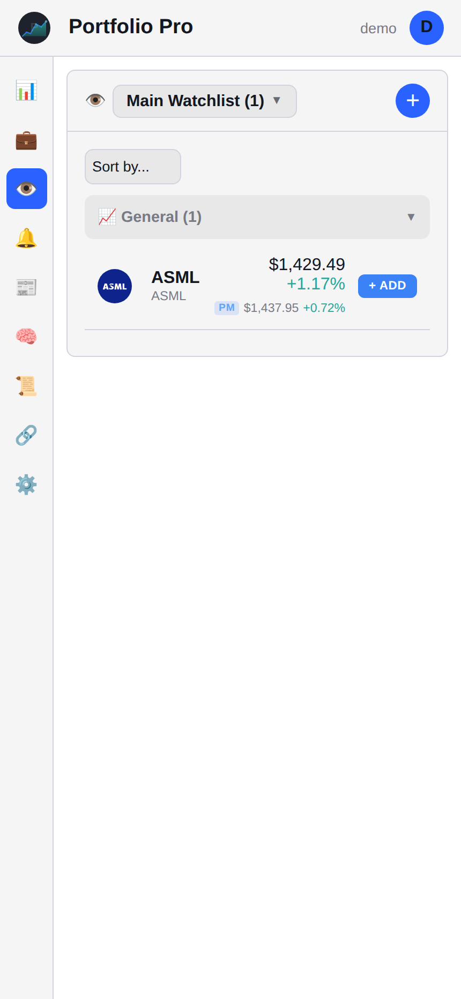
</p>

<p align="center">
  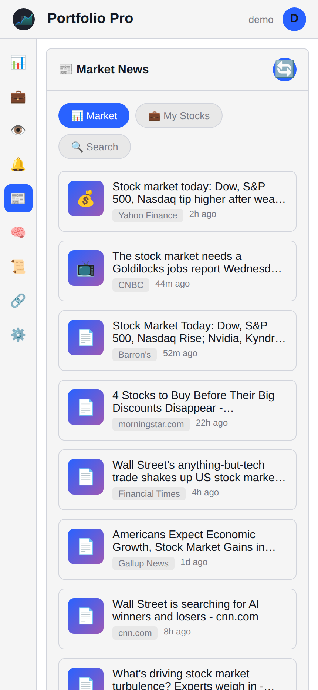
  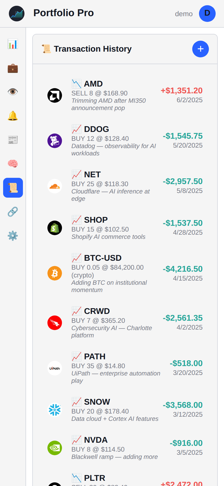
</p>

<p align="center">
  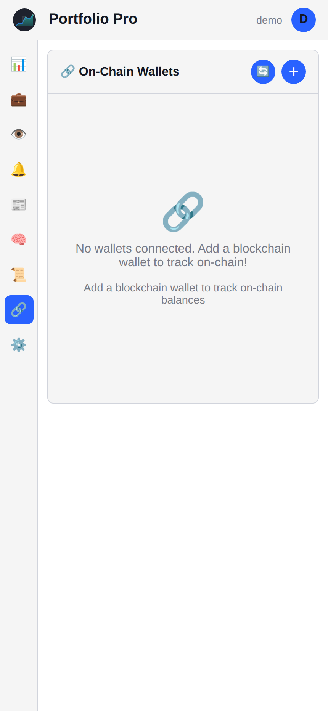
  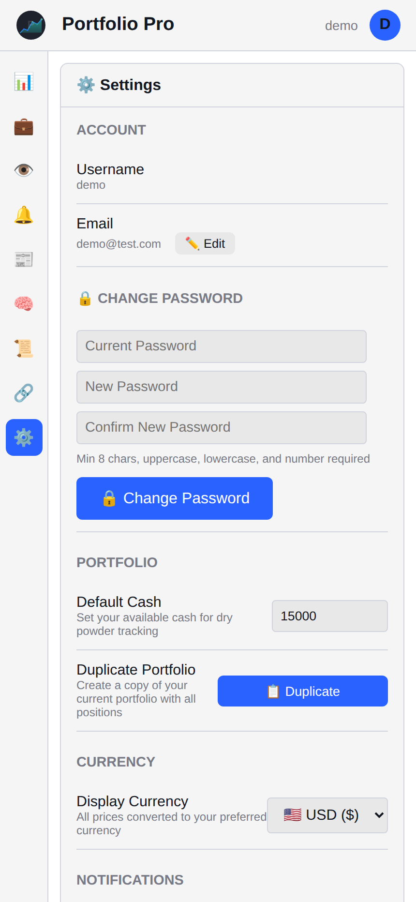
</p>

<p align="center">
  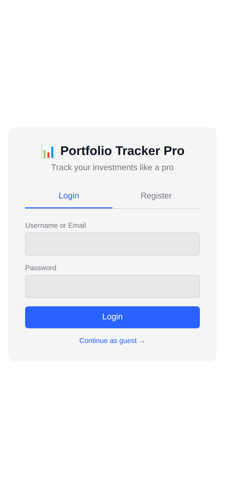
  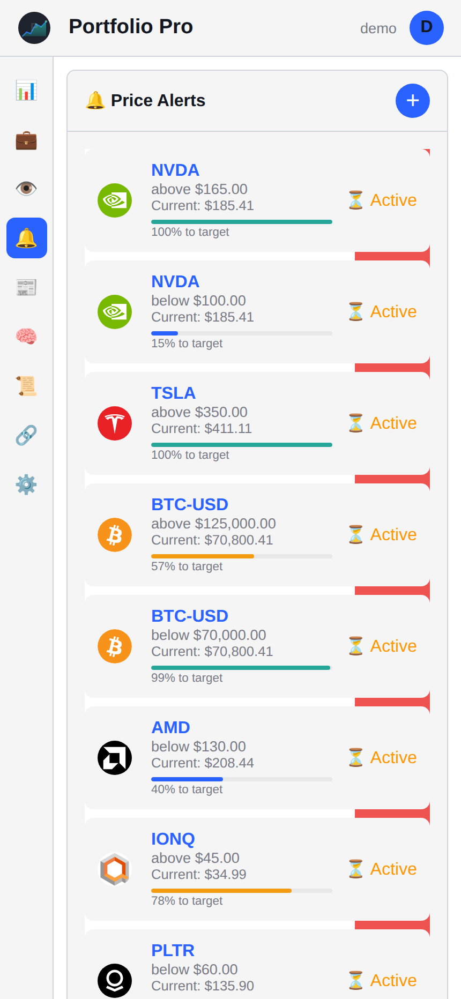
</p>

</details>

## Installation

### Docker Compose

```bash
git clone https://github.com/kiliansitel/portfolio-tracker-pro.git
cd portfolio-tracker-pro
docker-compose up -d
```

### Manual

```bash
git clone https://github.com/kiliansitel/portfolio-tracker-pro.git
cd portfolio-tracker-pro/server
npm install && npm start
```

📖 **[Full Manual](docs/MANUAL.md)** — User guide, API reference, self-hosting docs  
📦 **[Installation Guide](docs/INSTALL.md)** — Reverse proxy, env variables, backups

## Tech Stack

| Layer | Tech |
|-------|------|
| Frontend | Vanilla JS, [LightweightCharts](https://tradingview.github.io/lightweight-charts/), CSS3 |
| Backend | Node.js, Express, Helmet |
| Database | SQLite (sql.js) |
| Auth | JWT + Argon2id |
| AI | OpenAI, Anthropic, Google, Ollama, OpenRouter, OpenClaw |
| Infra | Docker multi-arch, GitHub Actions CI/CD |

## Version History

See **[VERSIONS.md](VERSIONS.md)** for full changelog.

| Version | Highlights |
|---------|-----------|
| **v0.21.3** | Docker UX, auto-sync wallets, watchlist auto-add, watchlist switching fix |
| **v0.21.2** | Ollama/LM Studio model auto-detection, login error fix |
| **v0.21.1** | Docker path fix, wallet delete button, chain address validation |
| **v0.21.0** "Oracle" | AI chat assistant, multi-provider, streaming SSE, conversation persistence |
| **v0.20.3** | Visual polish: 4-char logos, blue buttons, centered empty states, 20-color donut |
| **v0.20.2** | Position/watchlist sorting, loading skeletons, session timeout warning |
| **v0.20.1** | Password change, backup/restore, PWA, smart broker CSV import |
| **v0.20.0** "Compass" | Position source tracking, compact numbers, demo database, DeFi tracking |

## Roadmap

- [ ] After-hours / pre-market pricing
- [ ] Live broker API sync (Keytrade, IBKR)
- [ ] Dividend tracking & income calendar
- [ ] AI news digest & scheduled reports
- [ ] Portfolio rebalance suggestions
- [ ] Sector & geographic exposure views
- [ ] Google Cloud Run public demo
- [ ] Mobile app (React Native / Capacitor)

## License

MIT — Use it, fork it, self-host it.
