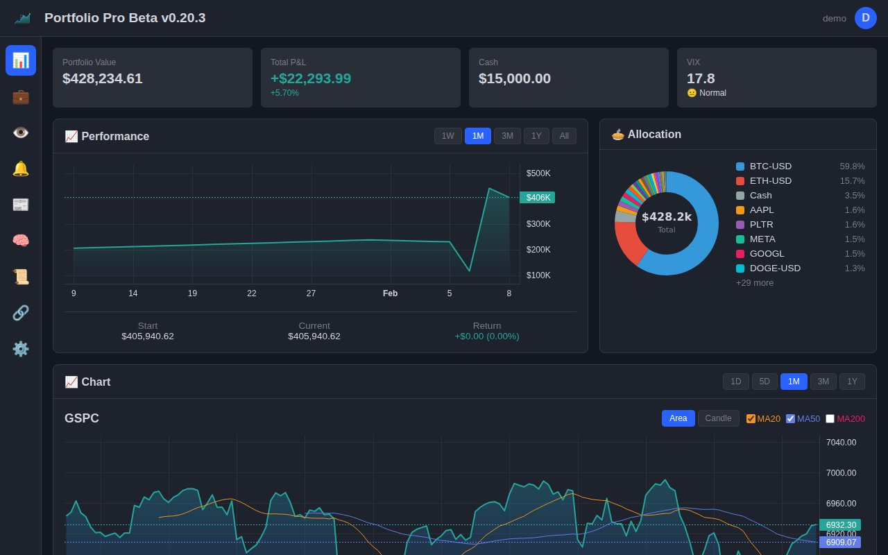
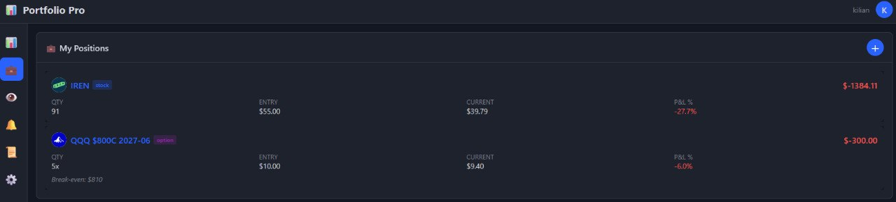
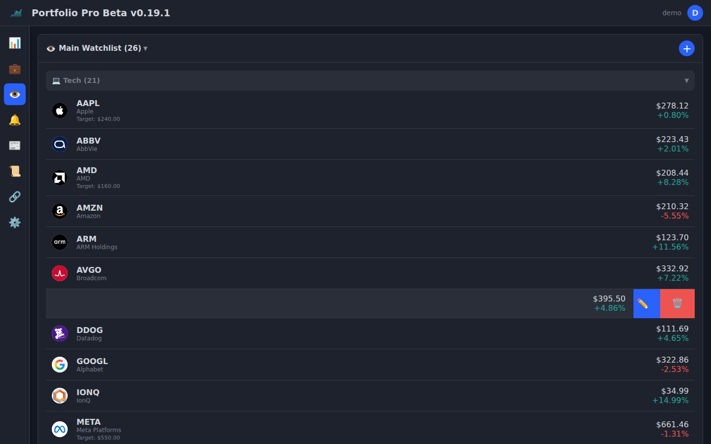
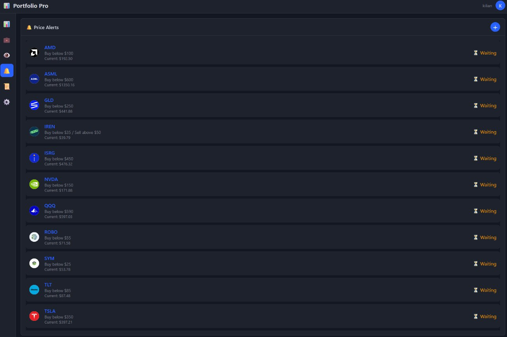
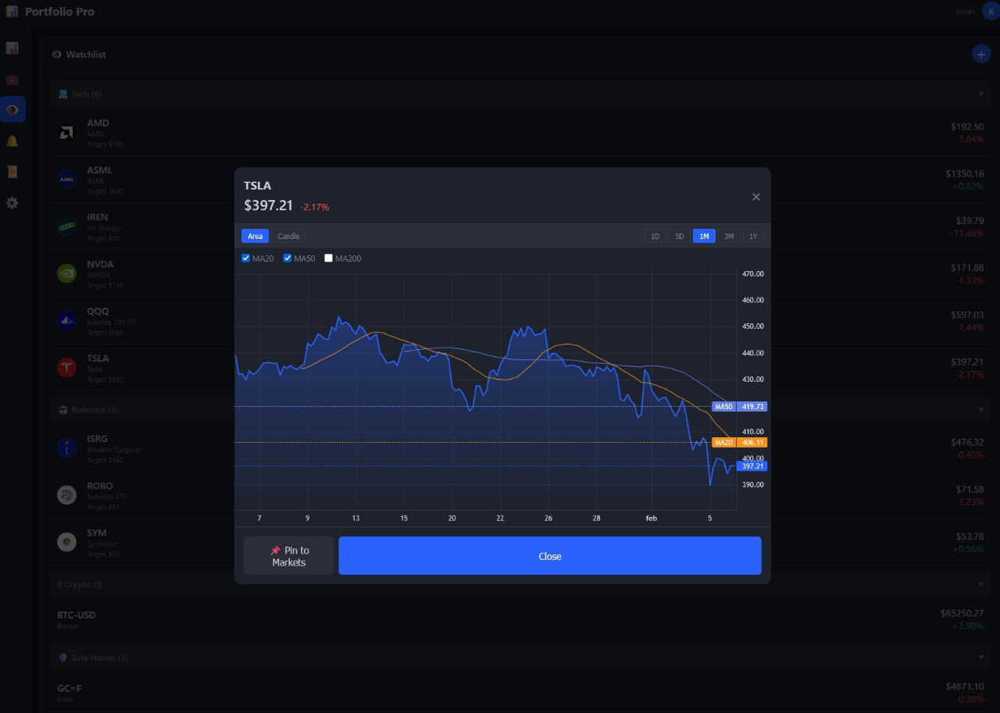

# Portfolio Tracker Pro

A TradingView-inspired portfolio tracker with real-time prices, interactive charts, and multi-user support.


## Features

- 📊 **Interactive Charts** — Area/candlestick views with MA20/50/200 overlays
- 💼 **Portfolio Management** — Track positions, options, and cash
- 👀 **Watchlists** — Customizable with categories and price alerts
- 🔔 **Alerts** — Set price targets with notifications
- 📱 **Mobile-First** — Swipe actions, collapsible sections, responsive design
- 👥 **Multi-User** — JWT auth with per-user portfolios
- ⚡ **Fast** — LocalStorage caching, multi-source price fallback

## Tech Stack

- **Frontend:** Vanilla JS, Chart.js, CSS3
- **Backend:** Node.js, Express
- **Database:** SQLite (sql.js)
- **Auth:** JWT + bcrypt

## Quick Start

```bash
# Install dependencies
cd server && npm install

# Start the server
npm start
# or
node index.js

# Open in browser
http://localhost:8080
```

## API Endpoints

| Method | Endpoint | Description |
|--------|----------|-------------|
| POST | `/api/auth/register` | Create account |
| POST | `/api/auth/login` | Get JWT token |
| GET | `/api/portfolios` | List portfolios |
| POST | `/api/portfolios/:id/positions` | Add position |
| GET | `/api/watchlists` | List watchlists |
| GET | `/api/alerts` | List alerts |

## Screenshots

### Dashboard


### Positions


### Watchlist


### Alerts


### Chart Detail


## Version History

See [VERSIONS.md](VERSIONS.md) for full changelog.

- **v0.8.0 "Detail"** — Full-screen charts, MA toggles, pin to Markets
- **v0.7.0 "Turbo"** — Chart caching, instant display
- **v0.6.0 "Swipe"** — TradingView-style swipe actions
- **v0.5.0 "Velocity"** — Price caching, multi-source fallback

## License

MIT
