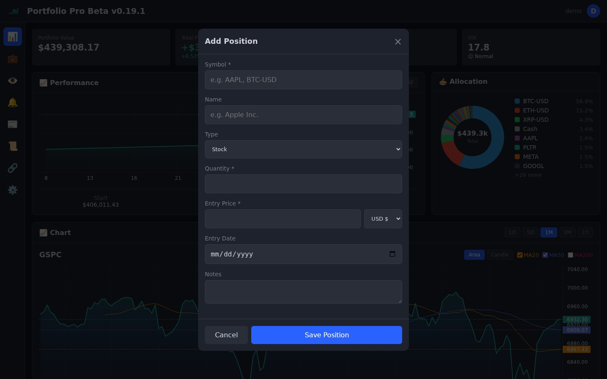
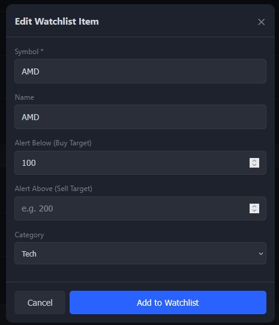
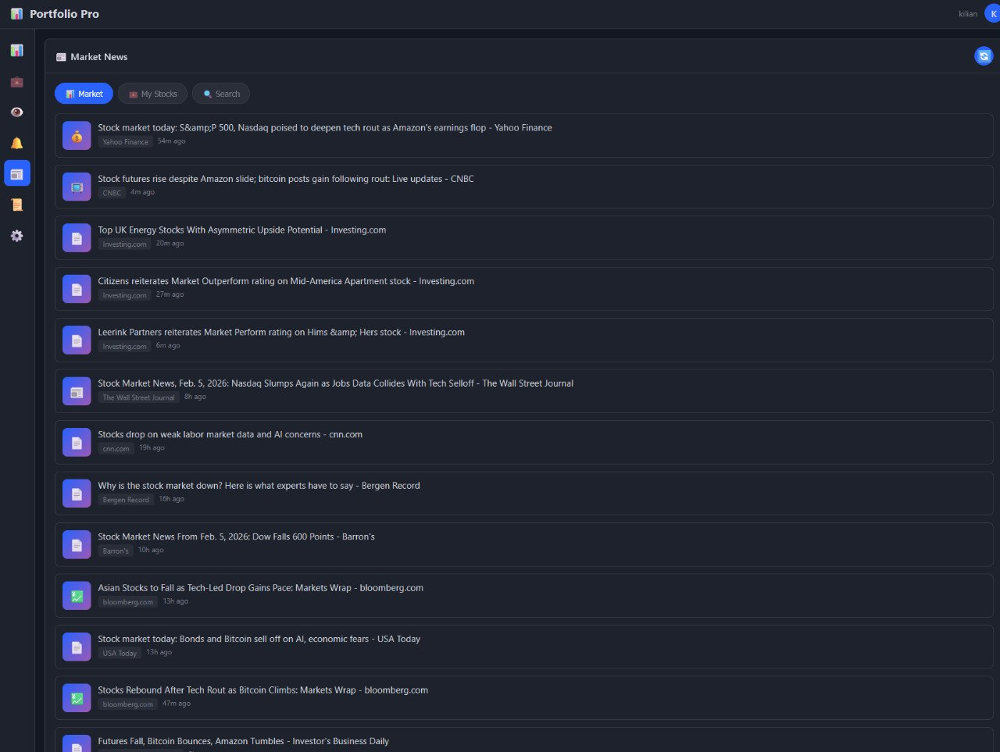
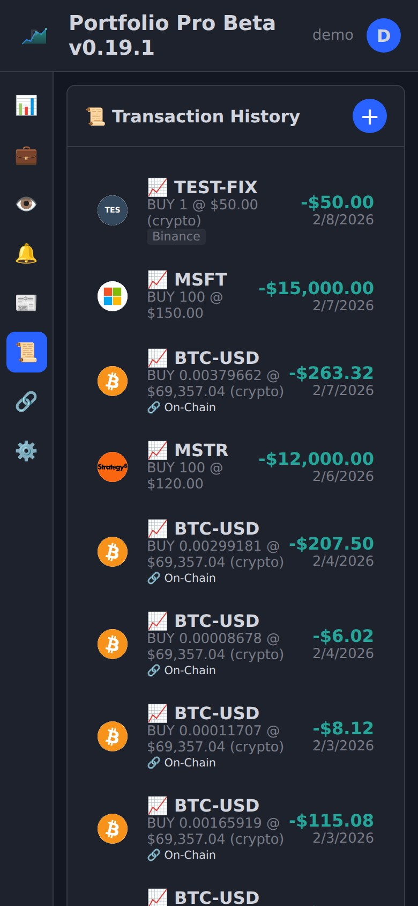
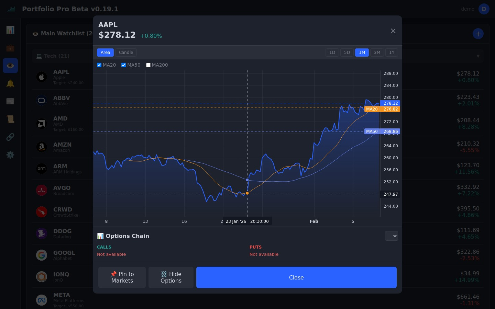
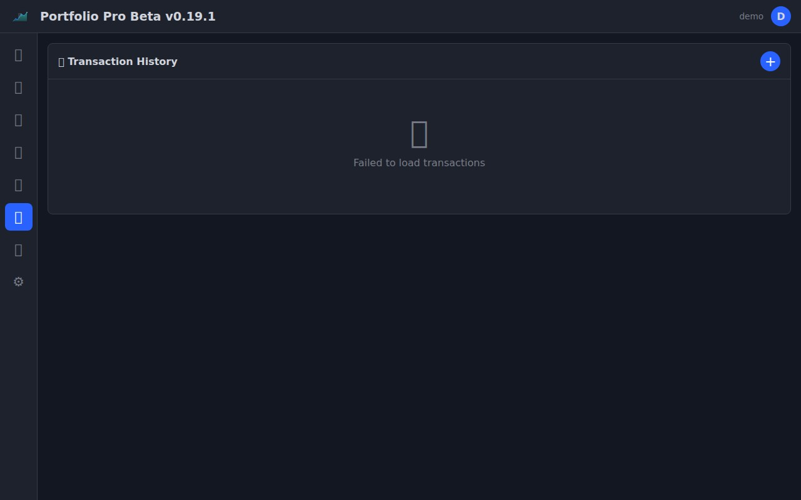
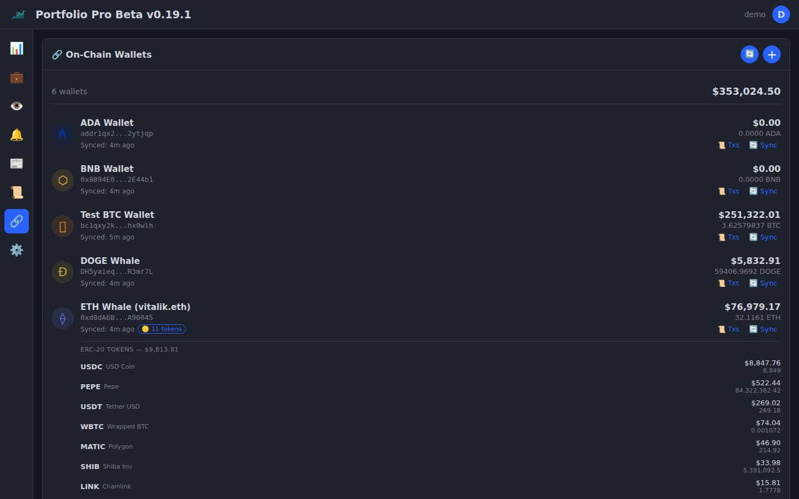
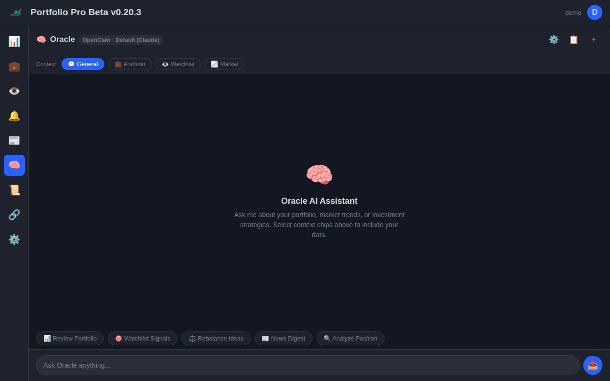
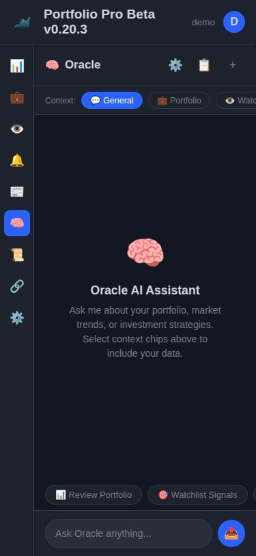
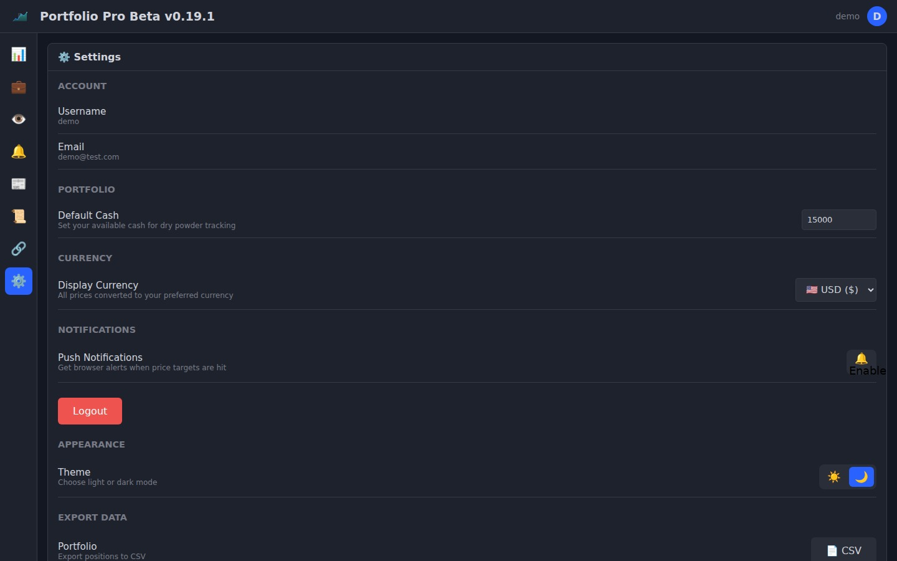

<p align="center">
  
</p>

<h1 align="center">Portfolio Tracker Pro</h1>

<p align="center">
  A TradingView-inspired portfolio tracker with real-time prices, interactive charts, crypto wallet tracking, and multi-user support.
</p>


## Features

- 🧠 **Oracle AI** — Multi-provider AI chat (OpenAI, Anthropic, Google, Ollama, OpenRouter, OpenClaw), portfolio review, watchlist signals, position deep dive, streaming SSE with markdown, conversation persistence
- 📊 **Charts & Analytics** — Interactive area/candlestick charts, MA overlays, allocation donut, performance history
- 💼 **Portfolio Tracking** — Positions, options, cash, transactions with P&L and source/location tracking
- 🔗 **13-Chain Wallet Sync** — BTC, ETH, SOL, BNB, AVAX, MATIC, ARB, OP, LTC, DOGE, XRP, ADA, DOT
- 🪙 **42 Auto-Detected Tokens** — ERC-20, SPL, and DeFi positions (Aave, Compound, Lido, Rocket Pool)
- 👀 **Watchlists & Alerts** — 12+ categories, price targets, Telegram & push notifications
- ⛓️ **Options Chain** — Calls/puts with strikes, expiry dates, ITM highlighting
- 📰 **News & Multi-Currency** — Real-time market news, EUR/USD/GBP/CHF with live FX rates
- 📱 **Mobile-First PWA** — Installable app, responsive design, compact numbers ($1.5M), swipe actions, loading skeletons
- 🔀 **Sort & Search** — Sort positions/watchlist by name, value, P&L%, or change%. Instant search filter
- 🔒 **Secure & Fast** — JWT + Argon2id, CSP, rate limiting, SQLite with indexed queries, session timeout warning
- 💾 **Backup & Restore** — Full database backup/restore, smart broker CSV import (Keytrade, IBKR, DeGiro)
- 🎁 **Demo Mode** — Pre-loaded portfolio for instant exploration
- 🐳 **Docker & CI/CD** — Multi-arch images (amd64/arm64), GitHub Actions pipeline

## Tech Stack

- **Frontend:** Vanilla JS, [LightweightCharts](https://tradingview.github.io/lightweight-charts/), CSS3
- **Backend:** Node.js, Express, Helmet
- **Database:** SQLite (sql.js) with indexed queries
- **Auth:** JWT + Argon2id (OWASP recommended)
- **Notifications:** Web Push (VAPID), Telegram Bot API
- **CI/CD:** GitHub Actions, Docker (multi-arch amd64/arm64)
- **AI:** Multi-Provider AI (OpenAI, Anthropic, Google, Ollama, OpenRouter, OpenClaw)
- **Security:** Rate limiting, input validation, CSP, audit logging

## Quick Start

### Docker (Recommended)
```bash
docker run -d -p 8080:8080 -v portfolio-data:/app/data kiliansitel/portfolio-tracker-pro:latest
```

### Docker Compose
```bash
git clone https://github.com/kiliansitel/portfolio-tracker-pro.git
cd portfolio-tracker-pro
docker-compose up -d
```

### Node.js
```bash
git clone https://github.com/kiliansitel/portfolio-tracker-pro.git
cd portfolio-tracker-pro/server
npm install && npm start
```

Open http://localhost:8080

### Demo Account
A pre-loaded demo portfolio is included for exploration:
- **Username:** demo
- **Password:** DemoPass123!

📖 **[Full Manual](docs/MANUAL.md)** — Complete user guide, API reference, and self-hosting docs

📦 **[Installation Guide](docs/INSTALL.md)** — Docker, reverse proxy, environment variables, backups

## API Endpoints

| Method | Endpoint | Description |
|--------|----------|-------------|
| POST | `/api/auth/register` | Create account |
| POST | `/api/auth/login` | Get JWT token |
| GET | `/api/portfolios` | List portfolios |
| POST | `/api/portfolios/:id/positions` | Add position |
| GET | `/api/watchlists` | List watchlists |
| GET | `/api/alerts` | List alerts |
| GET | `/api/options/:symbol` | Get options chain |
| GET | `/api/options/:symbol/:expiry` | Get options for expiry |
| GET | `/api/exchange-rates` | Get currency exchange rates |
| POST | `/api/push/subscribe` | Subscribe to push notifications |
| POST | `/api/push/unsubscribe` | Unsubscribe from push |
| POST | `/api/push/test` | Send test push notification |
| GET | `/api/history/:symbol` | Get stored OHLCV data |
| GET | `/api/history/status` | Collection stats |
| POST | `/api/history/collect` | Trigger OHLCV backfill |
| POST | `/api/portfolios/:id/snapshot/auto` | Auto portfolio snapshot |
| GET | `/api/wallets` | List connected wallets |
| POST | `/api/wallets` | Add wallet (chain, address) |
| DELETE | `/api/wallets/:id` | Remove wallet |
| POST | `/api/wallets/:id/sync` | Sync wallet balance |
| POST | `/api/wallets/sync-all` | Sync all wallets |
| GET | `/api/wallets/summary` | On-chain value summary |
| POST | `/api/wallets/:id/fetch-transactions` | Fetch chain transactions |
| GET | `/api/wallets/:id/transactions` | List chain transactions |
| GET | `/api/wallets/:id/tokens` | List wallet tokens |
| POST | `/api/wallets/:id/sync-tokens` | Sync tokens only |
| POST | `/api/portfolios/:id/duplicate` | Clone portfolio with positions |
| PUT | `/api/auth/password` | Change password |
| PUT | `/api/auth/email` | Update email |
| GET | `/api/backup` | Download full database backup |
| POST | `/api/backup/restore` | Restore from backup file |
| GET | `/api/info` | App version & environment |
| GET | `/api/ai/providers` | List available AI providers |
| POST | `/api/ai/providers` | Save AI provider config |
| DELETE | `/api/ai/providers/:provider` | Remove provider API key |
| POST | `/api/ai/chat` | Send chat message (SSE stream) |
| POST | `/api/ai/analyze/portfolio` | Quick portfolio review |
| POST | `/api/ai/analyze/watchlist` | Quick watchlist signals |
| POST | `/api/ai/analyze/position` | Quick position deep dive |
| GET | `/api/ai/conversations` | List saved conversations |
| POST | `/api/ai/conversations` | Save conversation |
| GET | `/api/ai/conversations/:id` | Load conversation |
| DELETE | `/api/ai/conversations/:id` | Delete conversation |

## Screenshots

### Dashboard


### Positions


### Add/Edit Position


### Watchlist


### Add to Watchlist


### Alerts


### News


### Transactions


### Chart Detail


### Options Chain


### Wallets


### Wallet Tokens


### Oracle AI Assistant


### Oracle AI (Mobile)


### Settings


## Version History

See [VERSIONS.md](VERSIONS.md) for full changelog.

- **v0.21.0 "Oracle"** — AI Intelligence Layer: multi-provider AI chat, streaming SSE, context injection, conversation persistence, OpenClaw auto-detection
- **v0.20.3** — Visual polish: 4-char logos, blue ADD buttons, centered empty states, 20-color donut
- **v0.20.2** — Position/watchlist sorting, empty states, skeletons, smart logo caching, session timeout
- **v0.20.1** — Password change, email edit, backup/restore, PWA, position search, keyboard shortcuts, smart broker import
- **v0.20.0 "Compass"** — Position source tracking, exchange/location fields, compact numbers, demo database, SPL tokens, DeFi tracking
- **v0.19.1** — ERC-20 token tracking, self-update system, UI polish
- **v0.19.0 "Chain"** — Blockchain wallet tracking (13 chains), positions redesign, auto-sync, on-chain transactions
- **v0.18.2 "Vault"** — Historical OHLCV storage, auto-snapshots, Docker/CI fixes, Playwright caching
- **v0.18.1 "Forge"** — Code modularization, multi-currency (EUR/USD/GBP/CHF), push notifications
- **v0.18.0 "Chain"** — Options chain viewer + security hardening (CSP, CORS, validators, debounced writes)
- **v0.17.5** — Logo in app header, CI fix
- **v0.17.4** — Project logo and favicon
- **v0.17.3** — Performance chart uses cost basis (matches P&L)
- **v0.17.2** — Fix performance chart rendering, allocation option prices
- **v0.17.1** — Fix options multiplier, rate limiting
- **v0.17.0 "Horizon"** — Portfolio performance chart with historical reconstruction
- **v0.16.0 "Slice"** — Portfolio allocation donut chart
- **v0.15.0 "Ironclad"** — Security hardening, CI pipeline, tests
- **v0.14.0 "Fortress"** — Argon2id password hashing (fixes #1)
- **v0.13.0 "Newswire"** — Market news integration
- **v0.12.0 "Chronicle"** — Transaction history, alert notifications
- **v0.11.0 "Container"** — Docker support
- **v0.10.0 "Export"** — CSV/PDF export
- **v0.9.0 "Theme"** — Dark/light mode
- **v0.8.0 "Detail"** — Full-screen charts, MA toggles

## Roadmap

### ✅ Completed
- [x] User authentication (JWT + Argon2id)
- [x] Portfolio & position tracking (stocks, options, crypto)
- [x] Watchlist with 12+ categories and price alerts
- [x] Telegram alert notifications
- [x] Transaction history with realized P&L
- [x] Interactive charts (area/candle, MA20/50/200)
- [x] Options chain viewer (calls/puts, expiry selector, ITM highlighting)
- [x] Portfolio performance chart
- [x] Allocation donut chart
- [x] News integration (Google News RSS)
- [x] Export to CSV/PDF
- [x] Docker + CI/CD pipeline
- [x] Security hardening (CSP, CORS, rate limiting, input validation, audit logging)
- [x] SVG ticker icons for crypto, commodities, indices, forex
- [x] Multi-currency support (EUR/USD/GBP/CHF) with live exchange rates
- [x] Push notifications (browser, VAPID-based)
- [x] Modular architecture (8 route modules, utility services)
- [x] Historical OHLCV price storage with daily collection
- [x] Automated daily portfolio snapshots
- [x] Blockchain wallet tracking (13 chains, auto-sync)
- [x] On-chain transaction history (BTC, ETH)
- [x] Positions page redesign (grouped, sorted, summary bar)
- [x] ERC-20 token tracking (20 popular tokens via RPC)
- [x] Token → position sync (auto-create portfolio positions from wallet tokens)
- [x] Self-update system (check updates, switch channels, one-click apply)
- [x] Comprehensive product manual (16 chapters)
- [x] Automated screenshot generation
- [x] Position source/location tracking with exchange fields
- [x] Demo database with example data
- [x] Compact number formatting for mobile
- [x] Password change, email edit from Settings UI
- [x] Full database backup & restore
- [x] PWA (installable, offline support, service worker)
- [x] Position/watchlist sorting and search
- [x] Smart broker CSV import (Keytrade, IBKR, DeGiro)
- [x] Loading skeletons, empty states, session timeout warning
- [x] Smart logo caching (zero 404s)

### 🧠 v0.21.0 "Oracle" — AI Intelligence Layer ✅
- [x] Multi-provider support (OpenAI, Anthropic, Google, Ollama, OpenRouter, OpenClaw, Custom)
- [x] API key management with encryption
- [x] Portfolio review & rebalancing suggestions
- [x] Watchlist scanner with entry/exit signals
- [x] Chat interface with streaming SSE and markdown rendering
- [x] Context injection (Portfolio, Watchlist, Market data)
- [x] Conversation persistence (save, load, delete)
- [x] Dynamic follow-up suggestions
- [x] OpenClaw auto-detection — zero config
- [x] Anthropic setup-token support
- [ ] Strategy advisor (options plays, DCA plans, hedging)
- [ ] Risk & correlation analysis
- [ ] AI-powered news digest for your holdings
- [ ] Scheduled auto-reports (daily/weekly AI briefings)

### 🔗 Blockchain Integration
- [x] Connect public addresses (13 chains: BTC, ETH, SOL, BNB, AVAX, MATIC, ARB, OP, LTC, DOGE, XRP, ADA, DOT)
- [x] Auto-sync balances from on-chain data (every 5 min)
- [x] Transaction history from block explorers (BTC, ETH)
- [x] Multi-wallet aggregation (sum per chain)
- [x] ERC-20 token tracking (20 popular tokens, direct RPC)
- [x] SPL token tracking (Solana — 14 popular tokens)
- [x] Token → position sync (wallet tokens auto-create positions)
- [x] DeFi position tracking (Aave, Compound, Rocket Pool, Lido)

### 🏦 Broker Integrations
- [ ] Exchange/broker API integration (Keytrade Bank, IBKR)
- [x] Import positions from broker CSV (Keytrade, IBKR, DeGiro, generic)
- [ ] More brokers TBD

### 🌐 Platform
- [ ] Google Cloud Run demo instance
- [x] PWA with offline support
- [ ] Mobile app (React Native or Capacitor)
- [ ] Multi-user sharing (read-only portfolio links)

## License

MIT
