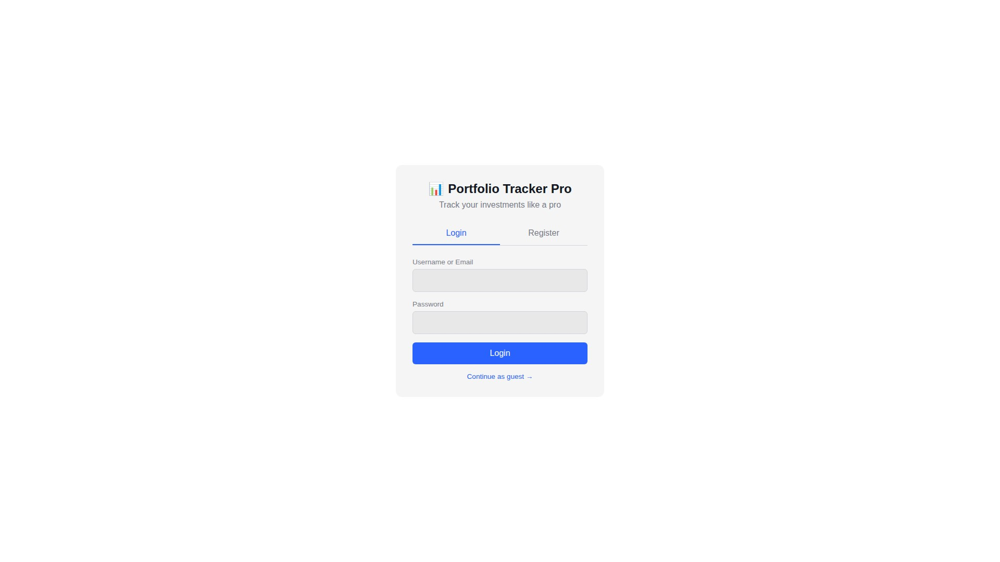
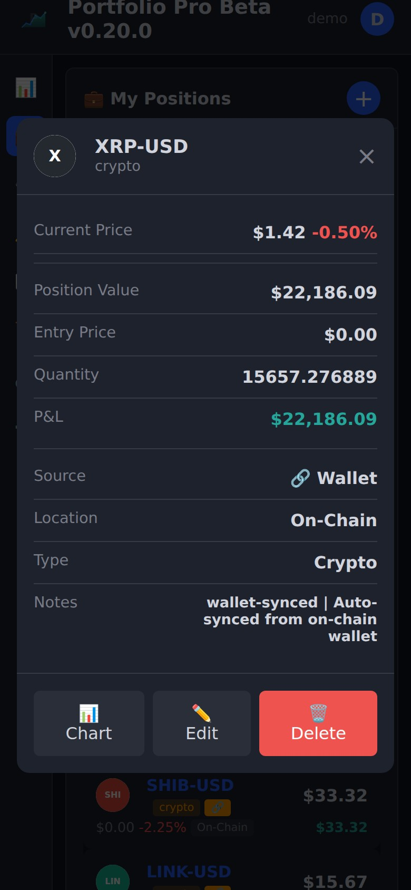
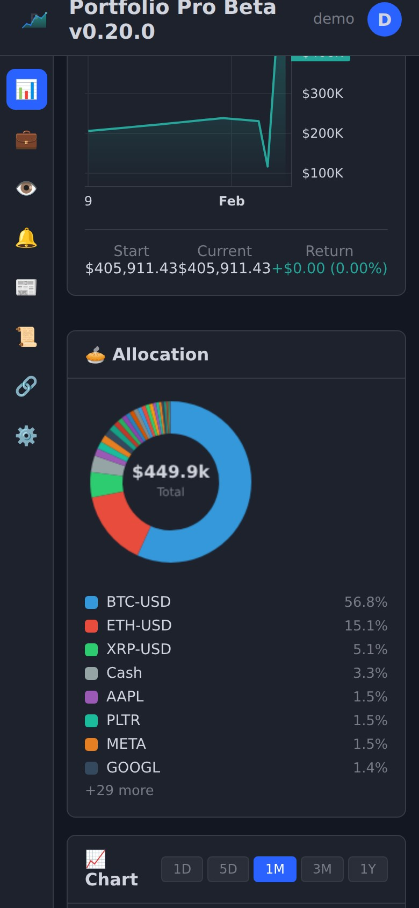
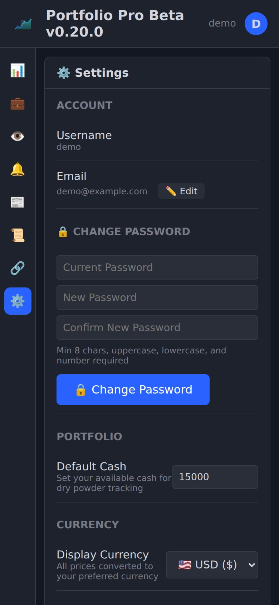
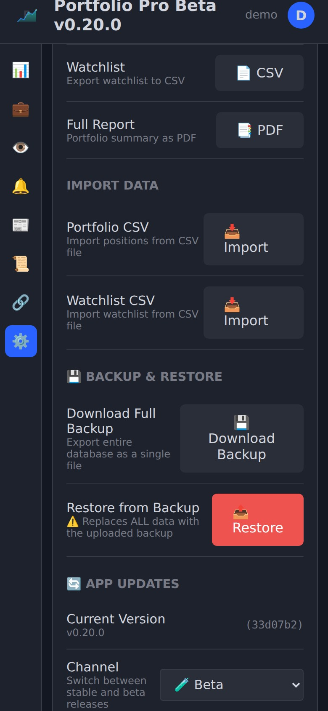

# Portfolio Tracker Pro — User Manual

<p align="center">
  
</p>

> **Version:** 0.20.0 · **License:** MIT · **Self-hosted** — your data stays on your machine.

---

## Table of Contents

- [1. Getting Started](#1-getting-started)
  - [1.1 Registration](#11-registration)
  - [1.2 Login](#12-login)
  - [1.3 Dashboard Overview](#13-dashboard-overview)
  - [1.4 Navigation](#14-navigation)
- [2. Portfolio Management](#2-portfolio-management)
  - [2.1 Creating Portfolios](#21-creating-portfolios)
  - [2.2 Adding Positions](#22-adding-positions)
  - [2.3 Editing Positions](#23-editing-positions)
  - [2.4 Deleting Positions](#24-deleting-positions)
  - [2.5 Position Types](#25-position-types)
  - [2.6 Options Positions](#26-options-positions)
  - [2.7 Cash Balance](#27-cash-balance)
- [3. Positions Page](#3-positions-page)
  - [3.1 Summary Bar](#31-summary-bar)
  - [3.2 Grouped View](#32-grouped-view)
  - [3.3 Position Cards](#33-position-cards)
  - [3.4 Wallet-Synced Positions](#34-wallet-synced-positions)
- [4. Blockchain Wallets](#4-blockchain-wallets)
  - [4.1 Adding a Wallet](#41-adding-a-wallet)
  - [4.2 Supported Chains](#42-supported-chains)
  - [4.3 Balance Syncing](#43-balance-syncing)
  - [4.4 ERC-20 Token Detection](#44-erc-20-token-detection)
  - [4.5 Wallet → Position Sync](#45-wallet--position-sync)
  - [4.6 On-Chain Transaction History](#46-on-chain-transaction-history)
  - [4.7 Deleting Wallets](#47-deleting-wallets)
- [5. Watchlists](#5-watchlists)
  - [5.1 Creating Watchlists](#51-creating-watchlists)
  - [5.2 Adding Tickers](#52-adding-tickers)
  - [5.3 Categories](#53-categories)
  - [5.4 Multiple Watchlists](#54-multiple-watchlists)
  - [5.5 Price Alerts from Watchlist](#55-price-alerts-from-watchlist)
- [6. Alerts](#6-alerts)
  - [6.1 Creating Price Alerts](#61-creating-price-alerts)
  - [6.2 Telegram Notifications](#62-telegram-notifications)
  - [6.3 Push Notifications](#63-push-notifications)
  - [6.4 Alert Management](#64-alert-management)
- [7. Charts](#7-charts)
  - [7.1 Ticker Search](#71-ticker-search)
  - [7.2 Chart Types](#72-chart-types)
  - [7.3 Moving Averages](#73-moving-averages)
  - [7.4 Time Ranges](#74-time-ranges)
  - [7.5 Full-Screen Chart Detail](#75-full-screen-chart-detail)
- [8. Options Chain](#8-options-chain)
  - [8.1 Opening the Options Chain](#81-opening-the-options-chain)
  - [8.2 Expiry Date Selection](#82-expiry-date-selection)
  - [8.3 Calls vs Puts](#83-calls-vs-puts)
  - [8.4 ITM Highlighting](#84-itm-highlighting)
- [9. Transactions](#9-transactions)
  - [9.1 Transaction History](#91-transaction-history)
  - [9.2 Recording Transactions](#92-recording-transactions)
  - [9.3 On-Chain Imported Transactions](#93-on-chain-imported-transactions)
  - [9.4 Realized P&L](#94-realized-pl)
- [10. News Feed](#10-news-feed)
  - [10.1 Market News](#101-market-news)
  - [10.2 Ticker-Specific News](#102-ticker-specific-news)
  - [10.3 Custom Search](#103-custom-search)
- [11. Performance & Analytics](#11-performance--analytics)
  - [11.1 Performance Chart](#111-performance-chart)
  - [11.2 Allocation Donut Chart](#112-allocation-donut-chart)
  - [11.3 Daily OHLCV Data](#113-daily-ohlcv-data)
- [12. Settings](#12-settings)
  - [12.1 Theme](#121-theme)
  - [12.2 Change Password](#122-change-password)
  - [12.3 Edit Email](#123-edit-email)
  - [12.4 Currency](#124-currency)
  - [12.5 Telegram Integration](#125-telegram-integration)
  - [12.6 Push Notifications](#126-push-notifications)
  - [12.7 Export Data](#127-export-data)
  - [12.8 Import Data](#128-import-data)
  - [12.9 Backup & Restore](#129-backup--restore)
  - [12.10 App Updates](#1210-app-updates)
- [13. API Reference](#13-api-reference)
  - [13.1 Authentication](#131-authentication)
  - [13.2 Auth Endpoints](#132-auth-endpoints)
  - [13.3 Portfolio Endpoints](#133-portfolio-endpoints)
  - [13.4 Watchlist Endpoints](#134-watchlist-endpoints)
  - [13.5 Alert Endpoints](#135-alert-endpoints)
  - [13.6 Market Data Endpoints](#136-market-data-endpoints)
  - [13.7 Transaction Endpoints](#137-transaction-endpoints)
  - [13.8 Wallet Endpoints](#138-wallet-endpoints)
  - [13.9 Push Notification Endpoints](#139-push-notification-endpoints)
  - [13.10 History Endpoints](#1310-history-endpoints)
  - [13.11 Data & Performance Endpoints](#1311-data--performance-endpoints)
  - [13.12 Update Endpoints](#1312-update-endpoints)
  - [13.13 Backup Endpoints](#1313-backup-endpoints)
  - [13.14 Utility Endpoints](#1314-utility-endpoints)
  - [13.15 Rate Limiting](#1315-rate-limiting)
  - [13.16 Error Format](#1316-error-format)
- [14. Self-Hosting](#14-self-hosting)
  - [14.1 Installation](#141-installation)
  - [14.2 Environment Variables](#142-environment-variables)
  - [14.3 Database Management](#143-database-management)
  - [14.4 Backup and Restore](#144-backup-and-restore)
  - [14.5 Systemd Service](#145-systemd-service)
- [15. Mobile Gestures & Power Tips](#15-mobile-gestures--power-tips)
  - [15.1 Swipe Actions](#151-swipe-actions)
  - [15.2 Desktop Hover Actions](#152-desktop-hover-actions)
  - [15.3 Power User Tips](#153-power-user-tips)
- [16. Troubleshooting](#16-troubleshooting)
  - [16.1 Common Issues](#161-common-issues)
  - [16.2 Password Reset](#162-password-reset)
  - [16.3 Database Recovery](#163-database-recovery)
  - [16.4 Service Won't Start](#164-service-wont-start)

---

## 1. Getting Started

### 1.1 Registration

When you first open Portfolio Tracker Pro, you'll see the login screen.



1. Click the **Register** tab at the top of the auth box.
2. Enter a **username**, **email**, and **password** (minimum 8 characters, must include uppercase, lowercase, and a number).
3. Click **Register**.

On successful registration, the app automatically:
- Creates a **Main Portfolio** with $0 cash.
- Creates a **Main Watchlist** for you to start tracking tickers.
- Logs you in with a 30-day session.


### 1.2 Login

1. Enter your **username or email** in the "Username or Email" field.
2. Enter your **password**.
3. Click **Login**.

Sessions last 30 days. Authentication uses httpOnly cookies by default (more secure) with JWT token fallback for API clients.

### 1.3 Dashboard Overview

After logging in, you land on the **Dashboard** page. It shows:

- **Portfolio Summary** — total value, P&L (profit & loss), today's change, and cash balance.
- **Performance Chart** — a line chart tracking your portfolio value over time (1W / 1M / 3M / 1Y / All views).
- **Allocation Chart** — a donut chart showing how your portfolio is split across positions.
- **Interactive Chart** — a full TradingView-style chart for any ticker, with area/candlestick views and moving average overlays.
- **Markets Overview** — pinned tickers showing live prices and daily changes.

### 1.4 Navigation

The left **sidebar** contains icon-based navigation. From top to bottom:

| Icon | Page | Description |
|------|------|-------------|
| 📊 | **Dashboard** | Portfolio overview, charts, performance |
| 💼 | **Portfolio** | Your positions (stocks, options, crypto) |
| 👁️ | **Watchlist** | Tickers you're watching, organized by category |
| 🔔 | **Alerts** | Price alerts (above/below targets) |
| 📰 | **News** | Market news feed |
| 📜 | **History** | Transaction history (buys, sells, on-chain) |
| 🔗 | **Wallets** | Blockchain wallet tracking |
| ⚙️ | **Settings** | Theme, currency, Telegram, exports, updates |

Clicking the **user avatar** (top-right) opens a dropdown with access to Settings and Logout.

---

## 2. Portfolio Management

### 2.1 Creating Portfolios

A "Main Portfolio" is created automatically on registration. To create additional portfolios:

1. Use the API: `POST /api/portfolios` with `{ "name": "Tech Picks", "cash": 5000 }`.

> **Note:** The current UI focuses on a single portfolio. Multiple portfolios are fully supported via the API and will be selectable in a future UI update.

### 2.2 Adding Positions


1. Navigate to the **Portfolio** page (💼).
2. Click the **+** button in the top-right of the card header.
3. In the modal that appears:
   - **Type:** Select Stock, Option/LEAP, Crypto, or ETF.
   - **Ticker:** Start typing and the autocomplete dropdown suggests matching symbols (e.g., type "BTC" → select "BTC-USD Bitcoin USD").
   - **Quantity:** Number of shares/contracts/coins.
   - **Entry Price:** Your average cost per unit.
   - **Currency:** The currency of the entry price (USD, EUR, GBP, CHF).
   - For **Options**: additional fields appear for Strike Price, Expiry Date, and Multiplier (defaults to 100).
4. Click **Add Position**.

**Tip:** If you add a position for a ticker that already exists, the app automatically calculates a new weighted average entry price and updates the quantity.

### 2.3 Editing Positions

- **Mobile:** Swipe left on a position card to reveal the **Edit** button.
- **Desktop:** Hover over a position card to reveal the **Edit** and **Delete** buttons.

Click **Edit** to open the position modal pre-filled with current values. Change what you need and click **Save**.

### 2.4 Deleting Positions

- **Mobile:** Swipe left on a position card and tap the red **🗑️** delete button.
- **Desktop:** Hover over a position card and click the red **🗑️** delete button.

### 2.5 Position Types

Each position has a type that determines how it's displayed and calculated:

| Type | Badge | Description |
|------|-------|-------------|
| **Stock** | Blue `STOCK` | Equities (AAPL, MSFT, NVDA, etc.) |
| **Option** | Purple `OPTION` | Options contracts and LEAPs |
| **Crypto** | Orange `CRYPTO` | Cryptocurrencies (BTC-USD, ETH-USD, etc.) |
| **ETF** | Blue `ETF` | Exchange-traded funds (QQQ, SPY, etc.) |

### 2.6 Options Positions

When adding an option position, additional fields become available:

- **Strike Price** — the exercise price of the option.
- **Expiry Date** — when the option expires.
- **Multiplier** — defaults to 100 (standard options contract = 100 shares).

The app automatically uses the multiplier when calculating position value:  
`Value = Quantity × Current Price × Multiplier`

### 2.7 Cash Balance

Your portfolio's cash balance is shown in the summary bar. Update it via the API:

```
PUT /api/portfolios/:id
Body: { "cash": 10000 }
```

Cash is included in total portfolio value and the allocation chart (displayed in gray).

---

## 3. Positions Page


### 3.1 Summary Bar

At the top of the Positions page, a four-column summary bar displays:

| Metric | Description |
|--------|-------------|
| **Total Value** | Sum of all position values + cash |
| **P&L** | Total unrealized profit/loss (current value − cost basis) |
| **Today** | Today's change across all positions |
| **Cash** | Portfolio cash balance |

Values are color-coded: **green** for gains, **red** for losses.

### 3.2 Grouped View

Positions are automatically organized into three collapsible groups, sorted by total value (highest first):

- **🪙 Crypto** — all cryptocurrency positions (BTC-USD, ETH-USD, etc.)
- **📈 Stocks** — all equity and ETF positions
- **📋 Options** — all options/LEAP positions

Each group header shows the count of positions in that group. Click the header to **collapse** or **expand** the group.

### 3.3 Position Cards



Each position card shows:

| Element | Description |
|---------|-------------|
| **Symbol + Icon** | Ticker symbol with SVG icon (crypto, commodities, indices get custom icons) |
| **Type Badge** | Colored badge (Stock / Option / Crypto / ETF) |
| **Current Price** | Live price in your selected currency |
| **Daily Change** | Today's price change in absolute and percentage |
| **Quantity** | Number of shares/contracts/coins |
| **Total Value** | Current price × quantity (× multiplier for options) |
| **P&L** | Unrealized profit/loss with percentage |

### 3.4 Wallet-Synced Positions

Positions created or updated from on-chain wallets display a **🔗** badge next to their name. These positions:

- Are automatically updated when wallets sync (every 5 minutes).
- Reflect the aggregated balance across all wallets for that chain.
- Are removed if all wallets for that chain are deleted.

---

## 4. Blockchain Wallets

### 4.1 Adding a Wallet


1. Navigate to the **Wallets** page (🔗).
2. Click the **+** button.
3. In the "Add Wallet" modal:
   - **Chain:** Select from the dropdown (13 chains available).
   - **Wallet Address:** Paste your public address (e.g., `bc1q...` for Bitcoin, `0x...` for Ethereum).
   - **Label:** Optional friendly name (e.g., "Cold Storage", "DeFi Wallet").
4. Click **Add Wallet**.

The wallet is added and an initial balance sync is triggered.

### 4.2 Supported Chains

Portfolio Tracker Pro supports **13 blockchain networks**:

| Icon | Chain | Ticker | Network |
|------|-------|--------|---------|
| ₿ | **Bitcoin** | BTC | Bitcoin mainnet |
| ⟠ | **Ethereum** | ETH | Ethereum mainnet |
| ◎ | **Solana** | SOL | Solana mainnet-beta |
| 🟡 | **BNB** | BNB | BNB Smart Chain |
| 🔺 | **Avalanche** | AVAX | Avalanche C-Chain |
| 🟣 | **Polygon** | MATIC | Polygon PoS |
| 🔵 | **Arbitrum** | ARB | Arbitrum One |
| 🔴 | **Optimism** | OP | OP Mainnet |
| 🪙 | **Litecoin** | LTC | Litecoin mainnet |
| 🐕 | **Dogecoin** | DOGE | Dogecoin mainnet |
| 💧 | **Ripple** | XRP | XRP Ledger |
| 🔷 | **Cardano** | ADA | Cardano mainnet |
| ⚪ | **Polkadot** | DOT | Polkadot relay chain |

### 4.3 Balance Syncing

Wallets support two sync modes:

- **Manual sync** — Click the **Sync** button on any wallet card, or **Sync All** at the top of the page.
- **Auto-sync** — Every 5 minutes (configurable via `WALLET_SYNC_INTERVAL_MS` environment variable, minimum 2 minutes), all wallets are synced in the background.

During sync, the app:
1. Queries the blockchain for the wallet's native token balance.
2. Fetches the current USD price via Yahoo Finance.
3. Calculates and displays the USD value.
4. Updates the corresponding portfolio position.

### 4.4 ERC-20 Token Detection


For **Ethereum** wallets, the app automatically discovers ERC-20 tokens:

- Checks balances of **20 popular tokens** (USDT, USDC, DAI, LINK, UNI, AAVE, SHIB, WBTC, WETH, MATIC, APE, PEPE, LDO, stETH, cbETH, CRO, OKB, FTM, SAND, MANA) via direct Ethereum RPC calls — **no API key required**.
- Displays tokens in an expandable list under each wallet.
- Each token shows: symbol, name, balance, and USD value.
- Dust balances below $1 are filtered out.
- Stablecoins (USDT, USDC, DAI) are tracked as tokens but not auto-created as portfolio positions (they're cash equivalents).

### 4.5 Wallet → Position Sync

When wallets sync, the app automatically manages portfolio positions:

1. **Creates** crypto positions for chains you hold (e.g., adding a BTC wallet creates a BTC-USD position).
2. **Updates** quantities to match your on-chain balance across all wallets for that chain.
3. **Deletes** positions when all wallets for a chain are removed.
4. **ERC-20 tokens** with non-stablecoin balances are also synced as portfolio positions (e.g., LINK-USD, UNI-USD).

Wallet-synced positions use entry price of $0 — the app displays current value and P&L based on current market prices.

### 4.6 On-Chain Transaction History

For **Bitcoin** and **Ethereum** wallets, the app can fetch transaction history from block explorers:

- Click **View Tx** on a wallet card (or use the API) to fetch transactions.
- Transactions show: direction (in/out), amount, fee, counterparty address, block height, and timestamp.
- Transactions are stored locally and linked to block explorer URLs for verification:
  - BTC → [mempool.space](https://mempool.space)
  - ETH → [etherscan.io](https://etherscan.io)
- On-chain transactions are automatically imported as app-level buy/sell records in the Transactions page.

> **Note:** Transaction history for other chains (SOL, BNB, etc.) is coming in a future release.

### 4.7 Deleting Wallets

- **Mobile:** Swipe left on a wallet card and tap **🗑️**.
- **Desktop:** Hover and click the delete button.

When a wallet is deleted:
- Its stored tokens and transaction history are also deleted.
- If no other wallets exist for that chain, the wallet-synced position is removed.
- If other wallets remain for that chain, the position quantity is recalculated from the remaining wallets.

---

## 5. Watchlists


### 5.1 Creating Watchlists

A "Main Watchlist" is created on registration. To create additional watchlists, use the **watchlist dropdown** at the top of the Watchlist page and select **+ New Watchlist**, or use the API:

```
POST /api/watchlists
Body: { "name": "Crypto Watch" }
```

### 5.2 Adding Tickers


1. Click the **+** button on the Watchlist page.
2. In the modal:
   - **Ticker:** Start typing to get autocomplete suggestions from 90+ popular tickers (US tech, crypto, ETFs, indices, commodities, European stocks, etc.).
   - **Category:** Select a category for organization.
   - **Alert Above / Alert Below:** Optionally set price alert targets directly.
3. Click **Add to Watchlist**.

### 5.3 Categories

Watchlist items are organized into collapsible category groups. Available categories:

| Category | Icon | Examples |
|----------|------|----------|
| **Tech** | 💻 | AAPL, MSFT, NVDA |
| **Robotics/AI** | 🤖 | ISRG, SYM, ARM |
| **Crypto** | 🪙 | BTC-USD, ETH-USD, SOL-USD |
| **Indices** | 📊 | ^GSPC, ^IXIC, ^DJI |
| **ETFs** | 📦 | QQQ, SPY, VTI |
| **Commodities** | ⚡ | GC=F (Gold), SI=F (Silver), CL=F (Oil) |
| **Forex** | 💱 | Currency pairs |
| **Energy** | ⚡ | CCJ, OKLO, URA |
| **Resources** | 🏔️ | Mining, natural resources |
| **Safe Haven** | 🛡️ | GLD, SLV, TLT |
| **Industrial** | 🏭 | ROK, TER |
| **General** | 📈 | Everything else |

Click a category header to **collapse** or **expand** it.

### 5.4 Multiple Watchlists

Use the **watchlist selector dropdown** at the top of the page to switch between watchlists. The dropdown is custom-styled to match the dark theme and shows all your watchlists by name. The "Main Watchlist" is selected by default.

### 5.5 Price Alerts from Watchlist

When adding or editing a watchlist item, you can set:
- **Alert Above** — triggers when the price rises above this value.
- **Alert Below** — triggers when the price falls below this value.

If set, the watchlist item shows a colored **🔔 BUY** or **🔔 SELL** badge.

---

## 6. Alerts


### 6.1 Creating Price Alerts

1. Navigate to the **Alerts** page (🔔).
2. Click the **+** button.
3. In the modal:
   - **Ticker:** Type and select from autocomplete.
   - **Condition:** "Alert when price goes **above**" or "**below**".
   - **Target Price:** The price level that triggers the alert.
4. Click **Create Alert**.

### 6.2 Telegram Notifications

When an alert triggers, the app can send a notification via **Telegram Bot API**. Set up:

1. Create a Telegram bot via [@BotFather](https://t.me/BotFather).
2. Configure the bot token in your `.env` file.
3. Set your `telegram_chat_id` in alert settings.

The notification message includes: symbol, condition, target price, and current price.

### 6.3 Push Notifications

Alerts also trigger **browser push notifications** (requires HTTPS):

1. Go to **Settings** → **Notifications** → click **🔔 Enable** for Push Notifications.
2. Allow the browser notification prompt.
3. Click **Test** to verify it works.

When an alert fires, you'll receive a push notification with the alert details even if the app isn't open.

> Push notifications require VAPID keys configured on the server. On HTTP connections, the button shows "Requires HTTPS" instead.

### 6.4 Alert Management

Each alert card shows:
- **Symbol** and **condition** (above/below).
- **Target price** and **current price**.
- **Progress bar** — visual indicator of how close the current price is to the target:
  - 🟢 Green: within 20% of target
  - 🟠 Orange: within 50% of target
  - 🔵 Blue: further away
- **Status** — Active (green) or Triggered (red, auto-deactivated).

**Delete** an alert by swiping left (mobile) or hovering (desktop) and tapping the **🗑️** button.

---

## 7. Charts

### 7.1 Ticker Search

The chart section on the Dashboard has a search field. Start typing a ticker symbol or company name to get autocomplete suggestions from the built-in ticker database (90+ symbols covering US tech, semiconductors, ETFs, crypto, commodities, European stocks, space/defense, and market indices).

### 7.2 Chart Types

Toggle between two chart types using the buttons above the chart:

- **Area** — smooth filled area chart (default), great for seeing trends.
- **Candle** — traditional candlestick chart showing open/high/low/close per period.

### 7.3 Moving Averages

Three moving average overlays can be toggled on/off:

| MA | Period | Typical Use |
|----|--------|-------------|
| **MA20** | 20-day | Short-term trend |
| **MA50** | 50-day | Medium-term trend |
| **MA200** | 200-day | Long-term trend |

Click the checkbox next to each MA to toggle its line on the chart.

### 7.4 Time Ranges

Select the time range for chart data:

| Range | Period | Interval |
|-------|--------|----------|
| **1D** | 1 day | 1-minute candles |
| **1W** | 5 days | 15-minute candles |
| **1M** | 1 month | Daily candles |
| **3M** | 3 months | Daily candles |
| **1Y** | 1 year | Daily candles |
| **5Y** | 5 years | Weekly candles |

### 7.5 Full-Screen Chart Detail


Click on any ticker (in the markets grid, watchlist, or positions) to open a **full-screen chart detail modal**. This modal provides:

- Larger chart area for detailed analysis.
- All the same controls (area/candle, MA toggles, time range).
- Current price, daily change, and percentage change.
- An **⛓️ Options** button to view the options chain for that ticker.

---

## 8. Options Chain


### 8.1 Opening the Options Chain

From the chart detail modal, click the **⛓️ Options** button to load the options chain for the displayed ticker. The options chain view appears below the chart.

### 8.2 Expiry Date Selection

The top of the options chain shows available **expiration dates** (up to 12 nearest dates). Click a date to load the calls and puts for that expiry.

### 8.3 Calls vs Puts

The options chain displays two tables side by side:

| Column | Description |
|--------|-------------|
| **Strike** | Strike price |
| **Last** | Last traded price |
| **Bid** | Best bid price |
| **Ask** | Best ask price |
| **Volume** | Trading volume |
| **OI** | Open interest |
| **IV** | Implied volatility (%) |

### 8.4 ITM Highlighting

**In-the-money** (ITM) options are highlighted:
- **Calls:** Highlighted when strike price < current stock price.
- **Puts:** Highlighted when strike price > current stock price.

Strike prices are filtered to ±15% of the current price to keep the view focused.

---

## 9. Transactions


### 9.1 Transaction History

The **History** page (📜) shows all your buy and sell records, sorted by date (newest first). Each transaction displays:

- **Date** of execution.
- **Action** — 📈 Buy or 📉 Sell.
- **Symbol** with type badge (Stock/Option/Crypto).
- **Quantity** and **price**.
- **Fees**.
- **Total** (quantity × price).
- **Portfolio name** it belongs to.

### 9.2 Recording Transactions

1. Navigate to the **History** page (📜).
2. Click the **+** button.
3. Fill in:
   - **Action:** Buy or Sell.
   - **Ticker:** Autocomplete search.
   - **Type:** Stock, Option, Crypto, or ETF.
   - **Quantity** and **Price**.
   - **Fees** (optional).
   - **Date** of execution.
   - **Notes** (optional).
4. Click **Add Transaction**.

### 9.3 On-Chain Imported Transactions

When on-chain transactions are fetched for Bitcoin or Ethereum wallets (see [4.6](#46-on-chain-transaction-history)), they are automatically imported as app-level transactions with:
- `action`: "buy" for incoming, "sell" for outgoing.
- `price`: the current market price at time of import.
- `notes`: a tag referencing the on-chain transaction hash.

### 9.4 Realized P&L

Sell transactions, combined with your entry prices, allow calculation of **realized profit and loss**. The transaction list shows the total value of each trade, enabling you to track your historical trading performance.

---

## 10. News Feed


### 10.1 Market News

The **News** page (📰) shows a live feed of market news from **Google News RSS**. News items display:
- **Title** with source icon.
- **Source** name (Bloomberg, CNBC, WSJ, Reuters, etc.).
- **Time** (e.g., "2h ago", "1d ago").

Click any news item to open the full article in a new tab.

### 10.2 Ticker-Specific News

Use the filter buttons at the top:
- **📊 Market** — general stock market news (default).
- **💼 My Stocks** — filters news for tickers in your portfolio.

### 10.3 Custom Search

Type any keyword into the **Search news...** field and press Enter to search for specific topics (e.g., "AI earnings", "Bitcoin ETF", "Fed rate decision").

---

## 11. Performance & Analytics

### 11.1 Performance Chart



The Dashboard features a **Performance Chart** that tracks your portfolio value over time:

- **Timeframe controls:** 1W, 1M, 3M, 1Y, All.
- **Summary stats:** Start value (cost basis), current value, total return ($ and %).
- **Daily snapshots:** Automatically saved on each visit and via a daily cron job (10 PM ET, Mon–Fri).
- **Historical reconstruction:** Can rebuild history from your transactions and position data, fetching historical prices from Yahoo Finance.

### 11.2 Allocation Donut Chart


A **donut chart** on the Dashboard shows portfolio breakdown:
- Each position gets a unique color slice.
- **Legend** shows the top 8 positions with their percentage allocation.
- **Cash** is shown as a gray slice.
- Hover or tap a slice to see the exact value and percentage.

### 11.3 Daily OHLCV Data

The app stores daily **Open/High/Low/Close/Volume** data for all tracked symbols:
- Collected automatically via a daily cron job after market close.
- Can be triggered manually via `POST /api/history/collect`.
- History goes back as far as Yahoo Finance provides (some symbols back to 1984).
- Used for historical chart rendering and performance calculations.

---

## 12. Settings


### 12.1 Theme

Toggle between **Dark mode** 🌙 and **Light mode** ☀️. The theme affects:
- All UI colors (background, text, borders).
- Chart colors (background, grid, line colors).
- Persists in localStorage across sessions.

### 12.2 Change Password



Change your password from the Settings page:

1. Enter your **Current Password** for verification.
2. Enter a **New Password** (minimum 8 characters, must include uppercase, lowercase, and a number).
3. Enter the new password again in **Confirm Password**.
4. Click **🔒 Change Password**.

The app verifies your current password before accepting the change. The new password is hashed with **Argon2id** (OWASP recommended) before storage.

### 12.3 Edit Email

Update your email address:

1. Click the **✏️ Edit** button next to your email in the Account section.
2. Enter your new email address.
3. Click **Save** (or **Cancel** to discard).

The app validates the email format and checks for duplicates before saving.

### 12.4 Currency

Choose your display currency from the dropdown:

| Currency | Symbol | Flag |
|----------|--------|------|
| **USD** | $ | 🇺🇸 |
| **EUR** | € | 🇪🇺 |
| **GBP** | £ | 🇬🇧 |
| **CHF** | CHF | 🇨🇭 |

All prices, values, and P&L figures are converted using **live exchange rates** fetched from Yahoo Finance. The currency preference is saved both locally and on the server so it persists across devices.

### 12.5 Telegram Integration

Set your **Telegram Chat ID** to receive alert notifications via Telegram. The chat ID links your account to a Telegram bot that sends messages when price alerts trigger.

### 12.6 Push Notifications

Browser push notifications require:
- **HTTPS** connection (won't work on plain HTTP).
- **VAPID keys** configured on the server (see [Environment Variables](#142-environment-variables)).

Controls:
- **🔔 Enable** — subscribes to push notifications.
- **Test** — sends a test notification to verify the setup.
- **Disable** — unsubscribes.

### 12.7 Export Data

| Export | Format | Contents |
|--------|--------|----------|
| **Positions CSV** | `.csv` | Symbol, quantity, entry price, type, value, P&L |
| **Watchlist CSV** | `.csv` | Symbol, name, category, alert levels |
| **Portfolio PDF** | Print dialog | Full portfolio summary (opens browser print) |

### 12.8 Import Data

| Import | Format | Description |
|--------|--------|-------------|
| **Portfolio CSV** | `.csv` | Import positions from a CSV file |
| **Watchlist CSV** | `.csv` | Import watchlist items from a CSV file |

Click the import button and select a `.csv` file. The app parses and adds the items to your portfolio or watchlist.

### 12.9 Backup & Restore



Full database backup and restore for disaster recovery or migration:

**Download Full Backup:**
1. Click **💾 Download Full Backup** in the Backup & Restore section.
2. A complete database file is downloaded as `portfolio-backup-YYYY-MM-DD.db`.
3. This includes ALL data: users, portfolios, positions, transactions, wallets, alerts, snapshots, OHLCV history.

**Restore from Backup:**
1. Click **📥 Restore from Backup** and select a `.db` backup file.
2. A confirmation dialog warns: *"⚠️ This will replace ALL current data with the backup. This cannot be undone."*
3. Click OK to proceed. The app validates the backup file structure before restoring.
4. The page reloads automatically after a successful restore.

> **⚠️ Warning:** Restore replaces the entire database. Make sure to download a backup of your current data first!

### 12.10 App Updates

The Settings page includes an **App Updates** section:

- **Current Version** — displays the installed version and git commit hash.
- **Channel** — choose between:
  - 🏷️ **Main (Stable)** — production releases only.
  - 🧪 **Beta** — latest features, may have bugs.
- **Auto-Update** — toggle (smooth iOS-style switch) to enable automatic updates.
- **Check for Updates** — manually checks GitHub for new releases or commits.
- **Apply Update** — one-click update that pulls the latest code, runs `npm ci`, and restarts the service.

When an update is available, the app shows how many commits are ahead and a button to apply.

---

## 13. API Reference

All API endpoints are served under `/api/`. Authentication is required for most endpoints.

### 13.1 Authentication

Portfolio Tracker Pro uses **JWT (JSON Web Tokens)** for authentication:

- Tokens are issued on login/registration with a **30-day expiry**.
- Tokens are stored in **httpOnly cookies** (primary) or can be sent via **Authorization header** (API clients).

**Cookie auth (automatic in browser):**
```
Cookie: auth_token=<jwt_token>
```

**Header auth (API clients):**
```
Authorization: Bearer <jwt_token>
```

### 13.2 Auth Endpoints

| Method | Path | Auth | Description |
|--------|------|------|-------------|
| `POST` | `/api/auth/register` | ❌ | Create a new account |
| `POST` | `/api/auth/login` | ❌ | Log in and get JWT |
| `GET` | `/api/auth/me` | ✅ | Get current user info |
| `PUT` | `/api/auth/settings` | ✅ | Update user settings / currency |
| `PUT` | `/api/auth/password` | ✅ | Change password |
| `PUT` | `/api/auth/email` | ✅ | Update email address |
| `POST` | `/api/auth/logout` | ❌ | Clear auth cookie |

**Register:**
```json
POST /api/auth/register
{
  "username": "john",
  "email": "john@example.com",
  "password": "MySecureP4ss"
}
→ { "message": "Registration successful", "token": "...", "user": { "id": 1, "username": "john" } }
```

**Login:**
```json
POST /api/auth/login
{
  "login": "john",
  "password": "MySecureP4ss"
}
→ { "token": "...", "user": { "id": 1, "username": "john", "settings": {} } }
```

**Change Password:**
```json
PUT /api/auth/password
{
  "currentPassword": "MySecureP4ss",
  "newPassword": "MyNewSecureP5ss"
}
→ { "message": "Password changed successfully" }
```

**Update Email:**
```json
PUT /api/auth/email
{
  "email": "newemail@example.com"
}
→ { "message": "Email updated successfully", "email": "newemail@example.com" }
```

**Update Settings:**
```json
PUT /api/auth/settings
{
  "currency": "EUR",
  "settings": { "theme": "dark", "telegram_chat_id": "123456" }
}
→ { "message": "Settings updated" }
```

### 13.3 Portfolio Endpoints

| Method | Path | Auth | Description |
|--------|------|------|-------------|
| `GET` | `/api/portfolios` | ✅ | List all portfolios |
| `POST` | `/api/portfolios` | ✅ | Create portfolio |
| `PUT` | `/api/portfolios/:id` | ✅ | Update portfolio name/cash |
| `DELETE` | `/api/portfolios/:id` | ✅ | Delete portfolio + positions |
| `GET` | `/api/portfolios/:id/positions` | ✅ | List positions |
| `POST` | `/api/portfolios/:id/positions` | ✅ | Add position (auto-merges duplicates) |
| `PUT` | `/api/portfolios/positions/:id` | ✅ | Update a position |
| `DELETE` | `/api/portfolios/positions/:id` | ✅ | Delete a position |

**Add Position:**
```json
POST /api/portfolios/1/positions
{
  "symbol": "NVDA",
  "quantity": 10,
  "entry_price": 450.00
}
→ { "id": 5, "portfolio_id": 1, "symbol": "NVDA", "quantity": 10, "entry_price": 450.00 }
```

**Duplicate handling:** If a position for `NVDA` already exists, the quantity is summed and entry price is recalculated as a weighted average.

### 13.4 Watchlist Endpoints

| Method | Path | Auth | Description |
|--------|------|------|-------------|
| `GET` | `/api/watchlists` | ✅ | List all watchlists with items |
| `POST` | `/api/watchlists` | ✅ | Create watchlist |
| `DELETE` | `/api/watchlists/:id` | ✅ | Delete watchlist + items |
| `POST` | `/api/watchlists/:id/items` | ✅ | Add item to watchlist |
| `PUT` | `/api/watchlists/items/:id` | ✅ | Update watchlist item |
| `DELETE` | `/api/watchlists/items/:id` | ✅ | Delete watchlist item |

### 13.5 Alert Endpoints

| Method | Path | Auth | Description |
|--------|------|------|-------------|
| `GET` | `/api/alerts` | ✅ | List all alerts |
| `POST` | `/api/alerts` | ✅ | Create price alert |
| `DELETE` | `/api/alerts/:id` | ✅ | Delete alert |
| `GET` | `/api/alerts/check` | API Key | Check alerts against live prices (cron) |

**Create Alert:**
```json
POST /api/alerts
{
  "symbol": "AAPL",
  "condition": "above",
  "target_price": 200.00
}
→ { "id": 3, "symbol": "AAPL", "condition": "above", "value": 200.00, "is_active": 1 }
```

**Alert check** (`GET /api/alerts/check`) is an internal endpoint used by the cron job. It requires the `X-API-Key` header matching `ALERT_API_KEY` from your `.env` file.

### 13.6 Market Data Endpoints

These are **public** (no auth required):

| Method | Path | Auth | Description |
|--------|------|------|-------------|
| `GET` | `/api/price/:symbol` | ❌ | Get single price (cached 2min) |
| `GET` | `/api/prices?symbols=X,Y` | ❌ | Get multiple prices (max 50) |
| `GET` | `/api/chart/:symbol` | ❌ | Get chart data |
| `GET` | `/api/options/:symbol` | ❌ | Get options chain |
| `GET` | `/api/options/:symbol/:expiry` | ❌ | Get options for specific expiry |
| `GET` | `/api/news` | ❌ | Get market news |
| `GET` | `/api/tickers/search?q=X` | ❌ | Search tickers |
| `GET` | `/api/tickers/popular` | ❌ | List all popular tickers |

**Chart query params:**
- `range`: `1d`, `5d`, `1mo`, `3mo`, `6mo`, `1y`, `2y`, `5y`, `10y`, `max`, `ytd`
- `interval`: `1m`, `2m`, `5m`, `15m`, `30m`, `60m`, `90m`, `1h`, `1d`, `5d`, `1wk`, `1mo`, `3mo`

**News query params:**
- `symbol`: Filter by ticker (e.g., `NVDA`).
- `query`: Free-text search (e.g., `AI earnings`).
- `limit`: Max results (default 10).

### 13.7 Transaction Endpoints

| Method | Path | Auth | Description |
|--------|------|------|-------------|
| `GET` | `/api/transactions` | ✅ | List all transactions |
| `GET` | `/api/transactions?symbol=AAPL` | ✅ | Filter by symbol |
| `GET` | `/api/portfolios/:id/transactions` | ✅ | List portfolio transactions |
| `POST` | `/api/portfolios/:id/transactions` | ✅ | Add transaction |
| `DELETE` | `/api/transactions/:id` | ✅ | Delete transaction |

**Add Transaction:**
```json
POST /api/portfolios/1/transactions
{
  "symbol": "AAPL",
  "action": "buy",
  "type": "stock",
  "quantity": 5,
  "price": 185.50,
  "fees": 1.00,
  "executed_at": "2026-01-15",
  "notes": "Bought the dip"
}
```

### 13.8 Wallet Endpoints

| Method | Path | Auth | Description |
|--------|------|------|-------------|
| `GET` | `/api/wallets` | ✅ | List wallets with USD values and tokens |
| `POST` | `/api/wallets` | ✅ | Add wallet |
| `DELETE` | `/api/wallets/:id` | ✅ | Delete wallet + cleanup |
| `POST` | `/api/wallets/:id/sync` | ✅ | Sync single wallet balance |
| `POST` | `/api/wallets/sync-all` | ✅ | Sync all wallets |
| `GET` | `/api/wallets/summary` | ✅ | On-chain value summary by chain |
| `POST` | `/api/wallets/:id/fetch-transactions` | ✅ | Fetch on-chain transactions |
| `GET` | `/api/wallets/:id/transactions` | ✅ | List stored on-chain transactions |
| `GET` | `/api/wallets/:id/tokens` | ✅ | List ERC-20 tokens for wallet |
| `POST` | `/api/wallets/:id/sync-tokens` | ✅ | Sync tokens only |

**Add Wallet:**
```json
POST /api/wallets
{
  "chain": "eth",
  "address": "0x1234...abcd",
  "label": "Main Wallet"
}
→ { "id": 1, "chain": "eth", "address": "0x1234...abcd", "label": "Main Wallet", "balance": 0 }
```

**Wallet list response** includes enriched data:
```json
{
  "id": 1,
  "chain": "eth",
  "address": "0x...",
  "balance": 2.5,
  "usd_value": 8750.00,
  "native_usd_value": 8500.00,
  "tokens_usd_value": 250.00,
  "chain_price": 3400.00,
  "chain_name": "Ethereum",
  "tokens": [{ "symbol": "LINK", "balance": "15.5", "usd_value": 250.00 }],
  "token_count": 1
}
```

### 13.9 Push Notification Endpoints

| Method | Path | Auth | Description |
|--------|------|------|-------------|
| `GET` | `/api/push/vapid-public-key` | ❌ | Get VAPID public key |
| `POST` | `/api/push/subscribe` | ✅ | Subscribe to push |
| `POST` | `/api/push/unsubscribe` | ✅ | Unsubscribe |
| `POST` | `/api/push/test` | ✅ | Send test notification |

### 13.10 History Endpoints

| Method | Path | Auth | Description |
|--------|------|------|-------------|
| `GET` | `/api/history/:symbol` | ✅ | Get stored OHLCV data |
| `GET` | `/api/history/status` | ✅ | Collection statistics |
| `POST` | `/api/history/collect` | ✅ | Trigger OHLCV backfill |

**OHLCV query params:**
- `from`: Start date (YYYY-MM-DD).
- `to`: End date (YYYY-MM-DD).
- `limit`: Max rows (default 365, max 5000).

**Status response:**
```json
{
  "total_rows": 12547,
  "symbols_tracked": 49,
  "earliest_date": "1984-09-07",
  "latest_date": "2026-02-07",
  "last_collection": "2026-02-07T03:00:00.000Z"
}
```

### 13.11 Data & Performance Endpoints

| Method | Path | Auth | Description |
|--------|------|------|-------------|
| `POST` | `/api/portfolios/:id/snapshot` | ✅ | Record portfolio snapshot |
| `GET` | `/api/portfolios/:id/performance` | ✅ | Get performance history |
| `POST` | `/api/portfolios/:id/reconstruct` | ✅ | Reconstruct history from transactions |
| `POST` | `/api/portfolios/:id/snapshot/auto` | ✅ | Auto-collect daily snapshot |

**Performance response:**
```json
{
  "snapshots": [{ "date": "2026-02-01", "total_value": 50000, ... }],
  "summary": {
    "total_return": 5000,
    "total_return_pct": 11.1,
    "start_value": 45000,
    "current_value": 50000,
    "days": 30
  }
}
```

### 13.12 Update Endpoints

| Method | Path | Auth | Description |
|--------|------|------|-------------|
| `GET` | `/api/updates/check` | ✅ | Check for updates |
| `GET` | `/api/updates/status` | ✅ | Current version/branch/settings |
| `POST` | `/api/updates/apply` | ✅ | Apply update (git pull + npm ci + restart) |
| `POST` | `/api/updates/settings` | ✅ | Update auto-update settings |

### 13.13 Backup Endpoints

| Method | Path | Auth | Description |
|--------|------|------|-------------|
| `GET` | `/api/backup` | ✅ | Download full database as binary |
| `POST` | `/api/backup/restore` | ✅ | Upload and restore from backup file |

**Download Backup:**
```
GET /api/backup
→ Binary SQLite database file (Content-Type: application/octet-stream)
```

**Restore from Backup:**
```
POST /api/backup/restore
Content-Type: application/octet-stream
Body: raw binary database file

→ { "message": "Database restored successfully", "tables": ["users", "portfolios", ...] }
```

### 13.14 Utility Endpoints

| Method | Path | Auth | Description |
|--------|------|------|-------------|
| `GET` | `/api/info` | ❌ | App version and environment |
| `GET` | `/api/exchange-rates` | ❌ | Currency exchange rates |

**Info response:**
```json
{
  "version": "0.20.0",
  "env": "production",
  "name": "Portfolio Pro"
}
```

### 13.15 Rate Limiting

The API enforces rate limits to prevent abuse:

| Scope | Limit | Window |
|-------|-------|--------|
| **Auth endpoints** | 10 requests | 15 minutes |
| **General API** | 100 requests | 1 minute |
| **Write operations** | 30 requests | 1 minute |
| **OHLCV collection** | Stricter limit | Shared with write ops |

Exceeding the limit returns `429 Too Many Requests`.

### 13.16 Error Format

All errors follow a consistent JSON format:

```json
{
  "error": "Human-readable error message"
}
```

Validation errors include details:
```json
{
  "error": "Validation failed",
  "details": [
    { "field": "password", "message": "Password must be at least 8 characters" }
  ]
}
```

HTTP status codes used:
- `400` — Bad request / validation error
- `401` — Authentication required
- `403` — Invalid or expired token
- `404` — Resource not found
- `429` — Rate limited
- `500` — Server error

---

## 14. Self-Hosting

### 14.1 Installation

For detailed installation instructions (Docker, Docker Compose, Node.js, reverse proxy), see the **[Installation Guide](INSTALL.md)**.

Quick start:

```bash
# Docker (simplest)
docker run -d -p 8080:8080 -v portfolio-data:/app/data kiliansitel/portfolio-tracker-pro:latest

# Or Node.js
git clone https://github.com/kiliansitel/portfolio-tracker-pro.git
cd portfolio-tracker-pro/server
npm install && npm start
```

### 14.2 Environment Variables

| Variable | Default | Description |
|----------|---------|-------------|
| `PORT` | `8080` | HTTP port |
| `JWT_SECRET` | Random (ephemeral) | **Set this in production!** Secret for JWT signing. Random if not set, but sessions won't survive restarts. |
| `DATA_DIR` | `/app/data` or `server/` | Directory for the SQLite database |
| `ALERT_API_KEY` | Random (ephemeral) | API key for the cron-based alert checker |
| `CORS_ORIGIN` | `false` (same-origin) | Set to a URL for cross-origin access |
| `VAPID_PUBLIC_KEY` | — | Web push: VAPID public key |
| `VAPID_PRIVATE_KEY` | — | Web push: VAPID private key |
| `ETHERSCAN_API_KEY` | — | Optional: Etherscan API key for ETH transactions |
| `WALLET_SYNC_INTERVAL_MS` | `300000` (5 min) | Wallet auto-sync interval (minimum 120000) |
| `APP_ENV` | `production` | Set to `beta` for beta branding |
| `NODE_ENV` | — | Set to `production` for secure cookies |

**Generate VAPID keys:**
```bash
npx web-push generate-vapid-keys
```

### 14.3 Database Management

Portfolio Tracker Pro uses **SQLite** (via sql.js, an in-memory SQLite compiled to WebAssembly):

- Database file: `portfolio.db` in the data directory.
- All schema migrations run automatically on startup (no manual steps needed).
- Database writes are **debounced** (batched within 1 second) for performance.
- 10+ indexes for fast queries.

> **⚠️ Important:** The database is loaded into memory on startup. If you need to edit the database file directly, **stop the service first**, make your changes, then restart. Otherwise the in-memory copy will overwrite your changes on the next save.

### 14.4 Backup and Restore

**Backup:**
```bash
# Docker
docker cp portfolio-tracker:/app/data/portfolio.db ./backup-$(date +%Y%m%d).db

# Local / systemd
cp /path/to/server/portfolio.db ./backup-$(date +%Y%m%d).db
```

**Restore:**
```bash
# Stop the service first!
sudo systemctl stop portfolio-tracker.service

# Replace the database
cp backup-20260207.db /path/to/server/portfolio.db

# Restart
sudo systemctl start portfolio-tracker.service
```

### 14.5 Systemd Service

For running on a Linux server with automatic restart:

```ini
# /etc/systemd/system/portfolio-tracker.service
[Unit]
Description=Portfolio Tracker Pro
After=network.target

[Service]
Type=simple
User=youruser
WorkingDirectory=/path/to/portfolio-tracker-pro/server
ExecStart=/usr/bin/node index.js
Restart=always
RestartSec=5
Environment=NODE_ENV=production
Environment=JWT_SECRET=your-secret-here
Environment=PORT=8080

[Install]
WantedBy=multi-user.target
```

```bash
sudo systemctl daemon-reload
sudo systemctl enable portfolio-tracker.service
sudo systemctl start portfolio-tracker.service

# Check status
sudo systemctl status portfolio-tracker.service

# View logs
journalctl -u portfolio-tracker.service -f
```

---

## 15. Mobile Gestures & Power Tips

### 15.1 Swipe Actions

On **mobile** (touch devices), swipe left on list items to reveal action buttons:

| Context | Actions Revealed |
|---------|-----------------|
| **Position card** | ✏️ Edit, 🗑️ Delete |
| **Watchlist item** | ✏️ Edit, 🔔 Alert, 🗑️ Delete |
| **Alert item** | 🗑️ Delete |
| **Wallet card** | 🗑️ Delete |
| **Transaction** | 🗑️ Delete |

Swipe ~80px to the left to reveal buttons, then release. Tap the revealed button to perform the action.

### 15.2 Desktop Hover Actions

On **desktop**, hover over any list item to reveal the same action buttons on the right side. No swiping needed — just hover and click.

### 15.3 Power User Tips

- **Quick chart access:** Click any ticker symbol (in watchlist, positions, or markets grid) to instantly open a full chart.
- **Autocomplete everywhere:** The ticker search in add-position, add-watchlist, and add-alert modals all support autocomplete with 90+ pre-loaded symbols.
- **Pin to Markets:** From the chart detail view, pin tickers to your dashboard markets grid.
- **LocalStorage caching:** The app caches price data and chart data in your browser's localStorage for instant loads. Data refreshes in the background every 2–5 minutes.
- **Multi-device currency:** Your currency preference syncs via the server, so switching to EUR on your phone also changes it on your desktop.
- **Collapsible sections:** Tap category headers in watchlists and position groups to collapse/expand. The collapse state is remembered.
- **CSV import format:** When importing positions via CSV, use columns: `symbol`, `quantity`, `entry_price`, `type`. For watchlist: `symbol`, `name`, `category`, `alert_above`, `alert_below`.

---

## 16. Troubleshooting

### 16.1 Common Issues

**Port already in use:**
```bash
lsof -i :8080          # Find what's using port 8080
PORT=3000 npm start    # Use a different port
```

**Prices not loading:**
- Yahoo Finance may be rate-limiting. The app has a 2-minute server-side cache.
- Check the server logs: `journalctl -u portfolio-tracker.service -f`.
- Prices are fetched from Yahoo Finance. Crypto tickers use the `-USD` suffix (e.g., `BTC-USD`).

**Push notifications not working:**
- HTTPS is **required**. On HTTP, the button will show "Requires HTTPS".
- Ensure `VAPID_PUBLIC_KEY` and `VAPID_PRIVATE_KEY` are set in your `.env`.
- Check that your browser supports the Push API and notifications are allowed.

**Wallet sync failing:**
- Some blockchain APIs have rate limits (especially blockchain.info for BTC, Etherscan for ETH).
- The app retries on the next auto-sync cycle (every 5 minutes).
- Check server logs for specific error messages.

**"Sessions will NOT survive restarts" warning:**
- Set `JWT_SECRET` in your `.env` file. Without it, a random secret is generated on each start, invalidating all existing sessions.

### 16.2 Password Reset

There is no built-in password reset UI yet. To reset a password manually:

```bash
# Stop the service
sudo systemctl stop portfolio-tracker.service

# Use sqlite3 CLI or a script to update the password
# The app uses Argon2id hashing, so you'll need to:
node -e "
const argon2 = require('argon2');
argon2.hash('NewPassword123', { type: argon2.argon2id, memoryCost: 19456, timeCost: 2, parallelism: 1 })
  .then(h => console.log(h));
"
# Copy the hash, then update the DB:
# sqlite3 portfolio.db "UPDATE users SET password='<hash>' WHERE username='john';"

# Restart
sudo systemctl start portfolio-tracker.service
```

### 16.3 Database Recovery

If the database becomes corrupted:

1. **Stop the service** immediately.
2. **Restore from backup:** `cp backup.db portfolio.db`
3. If no backup exists, delete the database and restart (this creates a fresh database):
   ```bash
   rm server/portfolio.db
   sudo systemctl start portfolio-tracker.service
   ```
4. Re-register and re-add your data.

### 16.4 Service Won't Start

Check the logs:
```bash
journalctl -u portfolio-tracker.service --no-pager -n 50
```

Common causes:
- **Missing dependencies:** Run `cd server && npm install`.
- **Port conflict:** Another process is using the configured port.
- **Permission denied:** Ensure the service user has read/write access to the data directory.
- **Node.js version:** Requires Node.js 18+. Check with `node --version`.
- **Corrupt database:** See [16.3](#163-database-recovery).

---

## Further Reading

- **[Installation Guide](INSTALL.md)** — Docker, reverse proxy, and deployment details.
- **[Version History](../VERSIONS.md)** — Full changelog for all releases.
- **[GitHub Repository](https://github.com/kiliansitel/portfolio-tracker-pro)** — Source code, issues, and releases.

---

*Portfolio Tracker Pro is open-source under the MIT license. Built with ☕ and late nights.*
